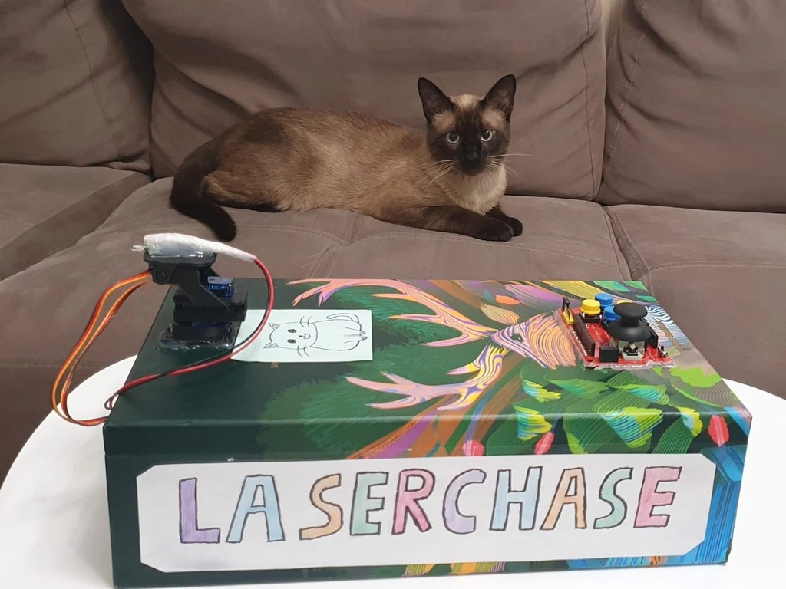
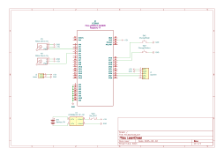

# LaserChase
A smart cat laser toy with manual or automatic movement patterns.

:::info 

**Author**: Ghiță Alexandru \
**GitHub Project Link**: [GitHub](https://github.com/UPB-PMRust-Students/proiect-Ghitzarino)

:::

## Description

LaserChase is a smart, interactive laser toy for cats, powered by a Raspberry Pi Pico 2W. The laser is mounted on two servo motors that allow it to move across two axes. It can operate in automatic mode - following 4 pre-programmed motion patterns (horizontal line, vertical line, rectangle or circle) plus a random pattern, or in manual mode - controlled by the joystick. Mode and pattern switching is done via async button presses, making the experience more dynamic and engaging. The goal is to mimic the unpredictable movement of real prey, keeping your cat entertained and active.

## Motivation

I wanted to create something practical and enjoyable for my personal use at home. As a cat owner, I thought this project would be a perfect blend of utility and fun-bringing joy to my pet while allowing me to experiment with hardware and software in an engaging way. Building LaserChase has given me the opportunity to explore electronics, real-time control, and embedded programming, all while making my cat happy.

## Architecture


The main software components of the project include:
- **Control Module**: Handles manual input from a joystick (ADC) and async button presses (GPIO) to switch modes and patterns while keeping the laser in motion.
- **Mode Manager**: Keeps track of the current operating mode and pattern count and interprets input accordingly.
- **Movement Generator**: Generates movement signals, from one of the 5 different patterns (automatic mode) or transformed from joystick input (manual mode).
- **Servo Driver**: Sends PWM signals to the two servo motors inside the 2-axis 3D printed stand to move the laser pointer mounted on top of it.

These components interact as follows:

- Input (buttons/joystick) -> Control Module -> Mode Manager -> Movement Generator -> Servo Driver -> Laser

### Modes and Patterns

Switching between modes and patterns is done via two GPIO buttons:

| Mode         | Description |
|--------------|-------------|
| Manual       | Joystick controls the laser |
| Auto Pattern 0 | Horizontal sweep |
| Auto Pattern 1 | Vertical sweep |
| Auto Pattern 2 | Rectangle tracing |
| Auto Pattern 3 | Circular path *(uses sin/cos)* |
| Auto Pattern 4 | Random hops *(using self implemented `rand32`)* |

## Log

<!-- write your progress here every week -->

### Week 5 - 11 May

Found out what how to connect and get input from buttons and joystick and how to power the laser and move the servo motors using the labs as example.
Got the rest of the needed components and a second Raspberry Pi Pico 2W as a debug probe for easier programming of the main controller.

### Week 12 - 18 May

Completed the schematic with a better understanding of how it should look like. Connected all of the harware components together and made sure they work.
Added a picture of the hardware in its current form. Played around with the code to start things up for the software part.

### Week 19 - 25 May

Finished setting up all of the needed hardware and started implemented the software.
After correctly connecting the joystick to the servos and getting async input from the buttons, I started testing different options for the patterns. The final patterns that remain implemented are: horizontal line, verical line, rectangular motion, circular motion and my personal favorite, (pseudo-)random motion.
Started building the final "product" to make the project good-looking for the PM fair presentation.

## Hardware

- **Raspberry Pi Pico 2W**: LaserChase uses a Raspberry Pi Pico 2W as the main controller.
- **SG90 Servo (x2) + Laser Pointer**: Two SG90 servos are used to move the laser pointer on two axes.
- **Joystick Shield**: Control is done via a joystick shield and mode and pattern switching through push buttons.
- **9V Battery + Holder + DC-DC Step Down Module**: Power is supplied through a 9V battery regulated by a step-down module to 5V.
- **Breadboard + Wires**: Components are connected using wires and a breadboard.

### Hardware progress




### Schematics



### Bill of Materials

<!-- Fill out this table with all the hardware components that you might need.

The format is 
```
| [Device](link://to/device) | This is used ... | [price](link://to/store) |

```

-->

| Device | Usage | Price |
|--------|--------|-------|
| [2x Raspberry Pi Pico 2W](https://www.raspberrypi.com/documentation/microcontrollers/raspberry-pi-pico.html) | Main microcontroller + debug probe | [80 RON](https://www.optimusdigital.ro/en/raspberry-pi-boards/13327-raspberry-pi-pico-2-w.html) |
| [2x SG90 Servo Motors](https://docs.m5stack.com/en/accessory/sg90_servo?ref=langship) | Control the X/Y axes of the laser | [24 RON](https://www.optimusdigital.ro/en/servomotors/2261-micro-servo-motor-sg90-180.html) |
| [Joystick Shield V1.A](https://handsontec.com/dataspecs/module/Arduino%20Shield/Joystick%20Shield.pdf) | Manual control of laser via joystick + buttons | [20 RON](https://www.optimusdigital.ro/en/arduino-shields/1283-shield-joystick-pentru-arduino.html) |
| [DC-DC Step Down Module](https://www.st.com/en/power-management/dc-dc-converter-modules/documentation.html) | Voltage regulation from 9V to 5V | [13 RON](https://www.optimusdigital.ro/en/adjustable-step-down-power-supplies/1108-lm2596hv-dc-dc-step-down-module.html) |
| 9V Battery + Holder | Power source | [10.3 RON](https://www.optimusdigital.ro/en/battery-holders/20-9v-battery-support.html) |
| 2x Breadboard | Circuit connection | [9 RON](https://www.optimusdigital.ro/en/breadboards/44-400p-hq-breadboard.html) |
| Wires | Connections between components | [8 RON](https://www.optimusdigital.ro/en/wires-with-connectors/890-set-fire-tata-tata-40p-30-cm.html) |
| Micro USB Cable | Power and programming cable | [4 RON](https://www.optimusdigital.ro/en/usb-cables/11939-micro-usb-black-cable-1-m.html) |
| 2x Header Pins | Connection to breadboard | [4 RON](https://www.optimusdigital.ro/en/pin-headers/85-40p-254-mm-pin-header-200-pcs.html) |
| Laser Pointer | Red colored laser | [2.6 RON](https://www.emag.ro/jucarie-laser-pentru-pisici-rosu-las02/pd/D6MMH5MBM/?ref=graph_profiled_similar_fallback_1_3&provider=rec&recid=rec_49_02188673a55cfa40086dd06e58c266684d055622826af4a5d7d376fa854708ce_1745921180&scenario_ID=49) |
| TOTAL | --- | 174.9 RON |

## Software

- Main task updates PWM every 25 ms based on current mode
- Each pattern is implemented as a separate function (except auto-sweep which incorporates 2 patterns):
  - `auto_sweep()` - moves in a horizontal or vertical line based on tick
  - `rectangle()` - moves in a rectangle shape using phases
  - `pattern_circle()` – moves in a circle using trigonometry
  - `pattern_random()` – jumps to random valid positions
- Buttons are handled in separate async tasks with debouncing
- Shared state is safely updated using `AtomicU8`

| Library | Description | Usage |
|---------|-------------|-------|
| [embassy](https://github.com/embassy-rs/embassy) | Async HAL & runtime | Core framework enabling async embedded development |
| [embassy-executor](https://docs.embassy.dev/embassy-executor/git/std/index.html) | Async task executor | Runs async tasks concurrently on the microcontroller |
| [embassy-rp](https://docs.embassy.dev/embassy-rp/git/rp2040/index.html) | Raspberry Pi Pico HAL | Provides peripheral access (ADC, GPIO, PWM, etc.) |
| [defmt](https://github.com/knurling-rs/defmt) | Logging & debug output | Efficient logging for embedded targets |
| [defmt-rtt](https://github.com/knurling-rs/defmt) | RTT backend for defmt | Transfers logs from the device over RTT (Real-Time Transfer) |
| [embassy-time](https://docs.embassy.dev/embassy-time/git/index.html) | Async timers and delays | Enables non-blocking timers with `Timer::after()` and `Duration` |
| [libm](https://docs.rs/libm/latest/libm/) | Lightweight math library | Used for `sinf` and `cosf` in pattern generation |
| [fixed](https://docs.rs/fixed/latest/fixed/) | Fixed-point math utilities | Provides traits for numeric conversions (`ToFixed`) |
| [panic-probe](https://docs.rs/panic-probe/latest/panic_probe/) | Panic handler for embedded | Minimal panic handler used for debugging |
| [core::sync::atomic](https://doc.rust-lang.org/core/sync/atomic/index.html) | Atomic operations | Thread-safe state sharing between async tasks |


## Links

<!-- Add a few links that inspired you and that you think you will use for your project -->

1. [Similar project](https://learn.adafruit.com/raspberry-pi-wifi-controlled-cat-laser-toy/overview)
2. [Controlling SG90 with PWM in Rust](https://blog.theembeddedrustacean.com/esp32-standard-library-embedded-rust-pwm-servo-motor-sweep)
3. [SG90 2-axis 3D print design](https://www.thingiverse.com/thing:2892903)
