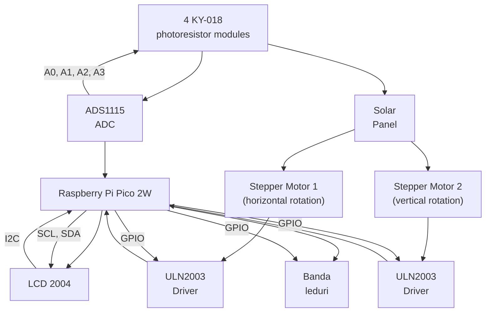

# Light tracker with solar pannel & LEDs 
A one line project description

:::info 

**Author**: Daria-Catalina Banu \
**GitHub Project Link**: https://github.com/UPB-PMRust-Students/proiect-Scarlett-stack

:::

## Description

A system that follows the most intense light source using photoresistors and rotates and translates vertically a mini-solar panel to maximize light capture. 

## Motivation

I chose this project because it allows me to explore embedded systems through a practical application that combines environmental awareness with precise motion control. Using stepper motors to orient a solar panel towards the most intense light source offers both a technical challenge and an opportunity to improve energy efficiency. This project also gives me hands-on experience with ADCs, real-time light tracking, and low-level motor control using Rust and the Embassy framework.

## Architecture 



- Light Sensor Module (ADC Sampling + Filtering)
Continuously reads values from 4 photoresistors (via ADC), applies a basic smoothing/filtering algorithm, and computes which direction has the strongest light intensity.

- Motor Control Module
Controls two stepper motors for horizontal and vertical movement. Uses a state machine to determine the required movement based on the output of the light sensor module.

- Tracking Algorithm
Coordinates input from the sensors and sends precise motor commands. Includes logic for tolerance thresholds, and movement limits.

- Display Module
Shows real-time status info (e.g., direction, light levels, current position) on the LCD2004 screen using pcf8754T module and i2c-characther-display crate

- Debug & Logging (defmt)
All internal states, sensor readings, and motor steps are logged via RTT for debugging and tuning purposes.

## Log

<!-- write your progress here every week -->
### Week 21 – 27 April 
Ordered hardware components updated the project's initial diagram, and also started exploring some rust crates compatible with my components.(uln2003, ads1x1x)
### Week 28 April – 4 May 
I tested some of the components on the breadboard to see if they work properly. (ky-018 photoresistor module, ads1115 adc convertor). I am also thinking of using a port expansion module for the led band, in case i run out of gpios on the pico.
### Week 5 - 11 May
Assembled everything on the breadboard using screws and also built a wooden support for the pannel, the breadboard , accumulator , solar pannel and the 4 photoresistor modules. I decided to use a transmission belt and a pulley for the vertical rotation stepper, since i didn't find the necessary pieces to attach the stepper directly to the bottom of the horizontal plane. Wrote code to test the steppers, lcd and ads.
### Week 12 - 18 May
I started using a power supply for breadboard module which can provide 5V or 3v3 depending on how I want to configure it. I actually measured the output and apparently it gives around 6V and 4V respectively. I might have accidentally burned the ADS when I connected it to the 5v power rail on the breadboard , because it kept outputting negative values, and as an emergency solution I decied to move 3 photoresistor modules back on the pico and keep only one on the ads. I replaced the old ads with a new one and it seems to work now. I still need to figure out a better approach to detect light fluctuations.


### Week 19 - 25 May

Implemented the full code , I decided to compute the averages on each analog channel then again average left, right, top bottom, choose minimum and rotate towards it. Calculated a threshold value expermientally, but it can be changed if need be. Sadly due to steppers being steppers and the way I designed the pannel support I decided to implement limitations for movement to not destroy the solar pannel or other hw components placed in the proximity. Also I had to fixate with screws the supporting tube because the transmission belt kept loosing momentum due to this tube's lack of proper fixation on the wooden support. I also added a few leds for fun. The voltmeter only outputs if there is enough light for the pannel to produce 4 V , i think i wasted my money on it :( .
## Hardware

- **Raspberry Pi Pico 2W** – The main microcontroller that runs the firmware using Rust and the Embassy async framework.

- **Raspberry Pi Pico Debug Probe**

- **4× Light Sensors + ADS1115 ADC** – Used to sense light intensity from different directions. The ADS1115 allows me to read data from the 4 modules

- **2× Stepper Motors (28BYJ-48) + ULN2003 Drivers** – Control the rotation and tilt of the solar panel. Each motor is driven by a ULN2003 driver module.

- **LCD2004 Display** – Displays real-time tracking information. Controlled using the hd44780-driver crate over I²C.

- **Battery Level Display Module** 

- **Accumulator**

- **Mini Solar Panel** – Rotates to face the brightest light source. Mounted on the motor platform.

- **Transmission Belt** – Used to rotate horizontally the solar pannel support.

- **6mm 15 Tooth Pulley**

- **Breadboard, jumper wires, resistors** – For prototyping and building the circuit.

### Schematics


### Bill of Materials

<!-- Fill out this table with all the hardware components that you might need.

The format is 
```
| [Device](link://to/device) | This is used ... | [price](link://to/store) |

```

-->

| Device                        | Usage                                               | Price     |
|------------------------------|-----------------------------------------------------|-----------|
| Raspberry Pi Pico 2W          | The main microcontroller        | 39.66 RON    |
| ADS1115 ADC Module           | 16-bit analog-to-digital converter for photoresistors | 32.98 RON    |
| KY-018 Photoresistor Module (x4) | Detects light intensity from different directions | 9.12 RON   |
| 28BYJ-48 Stepper Motor (x2)  | Provides panel rotation and tilt                    | 33.94 RON    |
| ULN2003 Driver Module (x2)   | Drives the stepper motors                           | inclus in stepper|
| LCD2004 Display with I²C     | Displays real-time tracking status                  | 26 RON    |
| PCF8574 I²C Port Expander    | Optional I/O expansion for controlling LEDs         | 9.99 RON    |
|      LEDs                    | Visual feedback on light intensity (1 green , 1 rgb) | 1 RON     |
| Mini Solar Panel             | panel that follows light                | 18 RON    |
| Breadboard, wires, resistors, wood, screws and pulleys | Prototyping and circuit building                    | ~40 RON   |
|MPPT Solar Charging module CN3065| To load accumulator| 8.35 RON|
|Indicator Tensiune pentru Acumulatori (4s)| To display battery level | 9.99 RON|
|Voltmetru| Display pannel voltage| 10.99 RON|
|Suport baterie| to place accumulator in it| free (found it in my home)|
| Sursa de alimentare pentru breadboard | to fire up steppers and lcd and sensors| 4.69 RON|
|Light sensor| to detect light variations| 4 x 3.20 RON|
|Debug Probe | debug| free (found it in my home) |

**Estimated Total**: 190.69 RON

## Software


| Library / Crate        | Description                                                                 | Usage                                           |
|------------------------|-----------------------------------------------------------------------------|-------------------------------------------------|
| [embassy](https://crates.io/crates/embassy)                | Async embedded framework for Rust                                           | Used for async task scheduling and peripherals  |
| [embassy-rp](https://crates.io/crates/embassy-rp)           | Embassy HAL implementation for RP2040/RP2350                               | Used for GPIO, ADC, PWM, I²C on the Pico W      |
| [embassy-time](https://crates.io/crates/embassy-time)       | Timing utilities for async delays                                           | Used for blinking LEDs, servo control, debouncing |
| [embassy-sync](https://crates.io/crates/embassy-sync)       | Async-safe synchronization primitives                                       | Coordination between async tasks (e.g., tracking + UI) |
| [defmt](https://crates.io/crates/defmt)                     | Lightweight logging framework                                               | Used for debugging over RTT                     |
| [defmt-rtt](https://crates.io/crates/defmt-rtt)             | Transports defmt logs over Real-Time Transfer                              | Debug output                                    |
| [panic-probe](https://crates.io/crates/panic-probe)         | Panic handler with defmt logging                                            | Used to capture and print panics in embedded code |
| [ads1x1x](https://crates.io/crates/ads1x1x)                 | Driver crate for ADS1115/ADS1015 ADCs                                       | Used to read analog values from photoresistors |
| [hd44780-driver](https://crates.io/crates/hd44780-driver)   | Driver for HD44780-based displays (like LCD2004 via I²C)                   | Used to display data on LCD screen              |
| [embedded-hal-async](https://crates.io/crates/embedded-hal-async) | Async traits for embedded-hal peripherals                              | Required by embassy for async I²C, ADC, etc.    |
 project/daria_catalina.banu
| [uln2003](https://crates.io/crates/uln2003)                     | to control steppers crate                                                | need to control steppers |
| [i2c-character-display](https://crates.io/crates/i2c-character-display)                     | to display on lcd2004                   | display      |


## Links

<!-- Add a few links that inspired you and that you think you will use for your project -->

0. [demo](https://youtu.be/r8KtfgD_oQc)
1. [link](https://docs.sunfounder.com/projects/pico-2w-kit/en/latest/pyproject/py_led.html)
2. [link](https://www.instructables.com/Stepper-Motor-Arduino-Solar-Tracker-EV/)
3. [link](https://maxpromer.github.io/LCD-Character-Creator/)
4. [link](https://www.penguintutor.com/electronics/pico-power)
5. [link](https://docs.cirkitdesigner.com/component/531c011f-c8eb-445e-baa0-00af94fa0bcb/mb102-breadboard-power-supply-module-33v5v)
...
