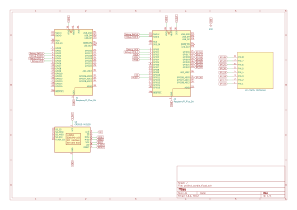

# Wordle
A Rust-based embedded implementation of the popular word-guessing game.


:::info
**Author**: Suliman Edis \
**GitHub Project Link**:https://github.com/UPB-PMRust-Students/proiect-Edis9955
:::

## Description

The project replicates the popular Wordle game developed by the New York Times, implemented using Rust on embedded hardware. Players must guess a secret 5-letter English word in 6 tries, receiving feedback on each guess through color-coded hints:

Green: Correct letter in the correct position

Yellow: Correct letter in the wrong position

Gray: Letter not in the word

## Motivation

This project is a nice first dip into the world of embedded systems. Wordle is a simple but engaging game, making it a great candidate to explore user interaction on low-power hardware while familirizing myself with Rust in an embedded environment.

## Architecture 
The core components of the project architecture include:

Game Engine (Rust): Handles word selection, guess evaluation, and game logic.

Input Handler: Receives user input from a connected keypad.

Display Driver: Outputs the game state on an LCD using color indicators.
Architecture Overview:

[Keypad/Touch Input] ---> [Input Handler] 
                                |
                                v
                        [Game Logic Engine]
                                |
                                v
                         [Display (ILI9341)]


## Log

<!-- write your progress here every week -->

### Week 5 - 11 May

### Week 12 - 18 May
hardware acquisition
debugger wiring and testing
display wiring
keypad wiring
kicad schematic
redo display wiring

### Week 19 - 25 May
code writing
display testing
keypad testing
keypad implmetnation to write letters

## Hardware
The project is built on a Raspberry Pi Pico platform with peripheral components for input, output, and storage. The display provides visual feedback while the keypad serves as the main input method.
### Schematics


### Bill of Materials

<!-- Fill out this table with all the hardware components that you might need.

The format is 
```
| [Device](link://to/device) | This is used ... | [price](link://to/store) |

```

-->Tastatura matriceala 4x4 

| Device | Usage | Price |
|--------|--------|-------|
| [2 x Raspberry Pi Pico 2W](https://www.optimusdigital.ro/ro/placi-raspberry-pi/13327-raspberry-pi-pico-2-w.html?search_query=raspberry+pi+pico+2w&results=26) | The microcontroller | [79 RON](https://www.optimusdigital.ro/en/raspberry-pi-boards/12394-raspberry-pi-pico-w.html) |
[Raspberry Pi Ecran LCD ILI9341](https://www.bitmi.ro/module-electronice/ecran-lcd-ili9341-cu-touch-si-slot-pentru-card-sd-2-4-10797-bitmi-ro.html) | Display | [67 RON](https://www.optimusdigital.ro/en/raspberry-pi-boards/12394-raspberry-pi-pico-w.html) |
[Breadboard](https://www.bitmi.ro/module-electronice/ecran-lcd-ili9341-cu-touch-si-slot-pentru-card-sd-2-4-10797-bitmi-ro.html) | 2 x Breadboard  | [7 RON](https://www.optimusdigital.ro/ro/prototipare-breadboard-uri/13249-breadboard-300-puncte.html?search_query=Breadboard+300+puncte&results=1) |
[4x4 input keypad](https://www.bitmi.ro/module-electronice/ecran-lcd-ili9341-cu-touch-si-slot-pentru-card-sd-2-4-10797-bitmi-ro.html) | keypad | [7 RON](https://www.optimusdigital.ro/ro/senzori-senzori-de-atingere/470-tastatura-matriceala-4x4-cu-conector-pin-de-tip-mama.html?search_query=Tastatura+matriceala+4x4&results=2) |
[wires ](https://www.optimusdigital.ro/ro/fire-fire-mufate/12-set-de-cabluri-pentru-breadboard.html?search_query=fire+breadboard&results=58) | wires for breadboard| [8 RON](https://www.optimusdigital.ro/ro/senzori-senzori-de-atingere/470-tastatura-matriceala-4x4-cu-conector-pin-de-tip-mama.html?search_query=Tastatura+matriceala+4x4&results=2) |
[mother-father wires](https://www.optimusdigital.ro/ro/fire-fire-mufate/878-set-fire-mama-tata-40p-30-cm.html?search_query=fire&results=426) | wires for display | [ RON](https://www.optimusdigital.ro/ro/senzori-senzori-de-atingere/470-tastatura-matriceala-4x4-cu-conector-pin-de-tip-mama.html?search_query=Tastatura+matriceala+4x4&results=2) |
[usb cable](https://www.bitmi.ro/module-electronice/ecran-lcd-ili9341-cu-touch-si-slot-pentru-card-sd-2-4-10797-bitmi-ro.html) | cable | [7 RON](https://www.optimusdigital.ro/ro/senzori-senzori-de-atingere/470-tastatura-matriceala-4x4-cu-conector-pin-de-tip-mama.html?search_query=Tastatura+matriceala+4x4&results=2) |


## Software

| Library | Description | Usage |
|---------|-------------|-------|
| [st7789](https://github.com/almindor/st7789) | Display driver for ST7789 | Used for the display for the Pico Explorer Base |
| [embedded-graphics](https://github.com/embedded-graphics/embedded-graphics) | 2D graphics library | Used for drawing to the display |
| [rand](https://crates.io/crates/rand)                      | Random number generation                   | Random word selection          |
| [colored](https://crates.io/crates/colored)                | Terminal color output | Color-coding of letters        |
| [display_interface_spi](https://crates.io/crates/display-interface-spi)                | Inteface for display | using the display        |

display_interface_spi
## Links

<!-- Add a few links that inspired you and that you think you will use for your project -->

1. [New York Times Wordle](https://www.nytimes.com/games/wordle/index.html)
3. [ILI9341 Driver Resources](https://docs.cirkitdesigner.com/component/b6591399-68e1-49f4-b5f6-0d512e7af130/ili9341-tft-display)
4. [Raspberry Pi Pico Documentation](https://www.raspberrypi.com/documentation/microcontrollers/pico-series.html)