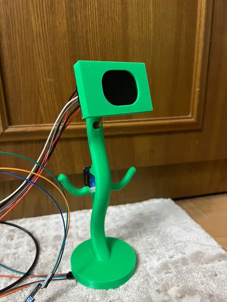
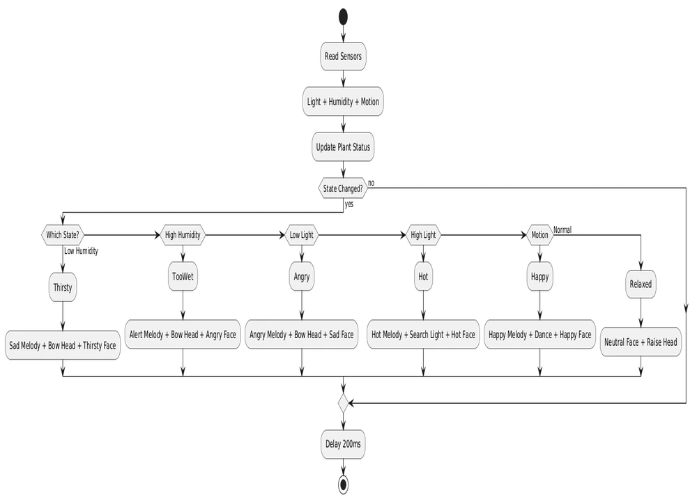

# PlantMood - Interactive Plant with Emotional Feedback

A plant that expresses emotions through movement and sound based on environmental conditions

:::info 

**Author**: Maria Tatiana Dinu  \
**GitHub Project Link**: [link_to_github](https://github.com/UPB-PMRust-Students/proiect-MariaDinu11)

:::

## Description

PlantMood is an interactive plant that monitors and reacts to environmental conditions. Using sensors, it detects soil humidity, light intensity, and human movement near it. This information is processed to determine the plant's "emotional state." Through servomotors, a speaker, and a display showing facial expressions, the plant expresses its "emotions" via specific movements, sounds, and visual feedback, such as dancing when happy, wilting when thirsty, or making sounds when it needs light.

## Motivation

My goal was to create an interactive and fun object that bridges the gap between technology and nature, while applying what I've learned about embedded systems programming in Rust. The challenge of interpreting sensor data as "emotions" and translating them into meaningful movements, sounds, and visual displays provided an excellent opportunity to explore creative applications of hardware and software integration. PlantMood represents both a technical challenge and an artistic expression of how technology can create emotional connections.

## Architecture

**Main Components**

**Raspberry Pi Pico 2W**: Central microcontroller that processes all data and manages the system

**Input Sensors:**

* **Light Sensor**: Monitors brightness levels
* **Motion Sensor**: Detects human presence nearby
* **Humidity Sensor**: Measures soil moisture

**Output Systems:**

* **Servomotor 1**: Controls petal movements
* **Servomotor 2**: Adjusts flower orientation
* **OLED Display**: Shows facial expressions representing emotions
* **Mini Speaker**: Produces responsive sounds

**How PlantMood Works**

Environmental Sensing: Sensors continuously monitor light conditions, soil moisture, and human proximity

Emotion Processing: Raspberry Pi determines the plant's "mood" based on sensor data

Expressive Responses:

* **Happy (good conditions):** Responds to human presence with petals dance and display shows a smile
* **Thirsty (low moisture):** Wilting movement and sad expression
* **Light-seeking:** Specific movements and sounds when light is insufficient

## Log

### Week 5 - 11 May
* Tested all individual hardware components on breadboard (sensors, servos, display, buzzer)
* Verified signal readings from the light, humidity, and motion sensors
* Basic functionality of servo motors and display with test scripts
* Designed the 3D model for the stem structure and the display support 

### Week 12 - 18 May
* Assembled the physical structure of the flower using the 3D printed stem and support components
* Put the servo motors in their holders for the movable parts of the flower
* Integrated the sensors into the plant structure and connected them to the microcontroller
* Tested all hardware components with various simulated flower states (happy, thirsty, low light) to ensure coordinated movement, sound, and display responses

### Week 19 - 25 May
* Finalized software implementation with all emotion states and coordinated responses
* Integrated servo control with smooth easing functions for natural movements
* Implemented concurrent audio-visual-mechanical responses using Embassy's async framework
* Completed display interface with all facial expressions (happy, sad, angry, thirsty, hot, neutral)
* Redesigned 3D models with minor improvements for better component fit and assembly
* Performed final system testing with all hardware components integrated

New stem design (without petals and leaves) 

## Hardware

* The project is built around a **Raspberry Pi Pico 2W** microcontroller
* Sensors are connected to specific GPIO pins:
   * Light sensor (photoresistor) connected to an ADC pin with a voltage divider with a 10kΩ resistor
   * Soil moisture sensor (Hygrometer 169) the analog output of this module is read through an ADC pin to detect soil humidity levels
   * PIR motion sensor connected to a digital input pin
* Output devices include:
   * Two SG90 micro servomotors for movement, one for moving the leaves and one for the "head"(display)
   * OLED display for facial expressions based on the plant's mood
   * Piezoelectric speaker for sound output, connected to a PWM pin
* The wires are routed inside the 3D-printed stem structure
* I will also 3D print models for the leaves and petals to complete the plant's physical form
* All electronic components and the structure are placed inside a decorative pot

## Schematic

**## Bill of Materials**
| Device | Usage | Price |
|--------|-------|-------|
| [2 x Raspberry Pi Pico 2W](https://datasheets.raspberrypi.com/picow/pico-w-datasheet.pdf) | Main microcontroller | [80 RON](https://www.optimusdigital.ro/ro/placi-raspberry-pi/13327-raspberry-pi-pico-2-w.html) |
| [LCD Screen ST7735](https://www.displayfuture.com/Display/datasheet/controller/ST7735.pdf) | Show the flower's expressions | [27.50 RON](https://www.amazon.de/-/en/gp/aw/d/B0CWN27HVB?psc=1&ref=ppx_pop_mob_b_asin_title) |
| [Fotoresistor](https://components101.com/resistors/ldr-datasheet) | Measures light | [2 RON](https://www.optimusdigital.ro/ro/componente-electronice-altele/28-fotorezistor10-pcs-set.html?search_query=fotorezistor&results=23) |
| [Soil Hygrometer Humidity (169) ] | Detects soil humidity | [15 RON](https://roboromania.ro/produs/senzor-umiditate-sol-soil-hygrometer-humidity-compatibil-arduino/) |
| [HC-SR501 PIR Sensor](https://www.mpja.com/download/31227sc.pdf) | Detects human presence | [6 RON](https://www.optimusdigital.ro/en/pir-sensors/106-pir-hc-sr501.html?srsltid=AfmBOorZI5Tx81YCNwBztwCePfGdYnxJOmEtJQxTIgrIqr90K6c5tCTP) |
| [2 x Micro Servomotor SG90 180°](http://www.ee.ic.ac.uk/pcheung/teaching/DE1_EE/stores/sg90_datasheet.pdf) | Provide movement for emotional expression | [24 RON](https://www.optimusdigital.ro/ro/motoare-servomotoare/2261-micro-servo-motor-sg90-180.html?search_query=sg90&results=11) |
| [Modul Buzzer Pasiv](https://www.handsontec.com/dataspecs/module/passive%20buzzer.pdf) | Produces sounds for emotional expression | [2 RON](https://www.optimusdigital.ro/ro/componente-electronice/12598-modul-buzzer-pasiv.html?gad_source=1&gclid=Cj0KCQjwoNzABhDbARIsALfY8VMoi6H556JZ4T7UA8RZjom6AfKyBbEN-66IqZc9k7q6qC3vH-RFrvYaArAuEALw_wcB) |
| [Breadboard Kit HQ 830 p] | Component connections | [22 RON](https://www.optimusdigital.ro/en/kits/2222-breadboard-kit-hq-830-p.html?search_query=breadboard+kit&results=41) |
| [Resistor Kit](https://www.mouser.com/datasheet/2/447/Yageo_LR_MFR_1-1714151.pdf) | Circuit components | [5 RON](https://www.optimusdigital.ro/ro/componente-electronice-diverse/11-set-de-rezistente.html) |

## Software

   The system implements a state machine pattern for emotion processing with concurrent sensor monitoring and output control.

**1. Main Control Loop (main.rs)**

* Sensor Reading: Continuous ADC sampling for light and humidity sensors, plus digital PIR input
* Async Runtime Management: Built on Embassy-rs framework
* State Machine Engine: Determines plant emotions by comparing sensor values to preset thresholds
* Concurrent Output Control: Synchronizes audio, visual, and movement responses simultaneously

**2. Plant State Management (plant_states.rs)**

The system defines six distinct emotional states for the plant:

* Happy: Triggered when motion is detected, creates interactive response
* Thirsty: Activated when humidity drops below 30%, indicates need for water
* Angry: Occurs when light levels fall below 20%, shows insufficient illumination
* TooWet: Triggered when humidity exceeds 80%, indicates overwatering
* Hot: Activated when light exceeds 85%, shows excessive light or heat
* Relaxed: Default state when all conditions are optimal

The PlantStatus struct tracks the current and previous emotional states, stores real-time sensor data, and determines when to trigger new 
responses based on sensor thresholds.

**3. Hardware Control Modules**

*Servo Control (servo.rs)*
PWM signal generation with precise timing control
Smooth movement interpolation using easing functions
Position tracking for coordinated multi-servo movements

Creates specific movement patterns for different emotions:
* dance_plant(): Happy dancing sequence with different positions
* bow_head(): Sad head drooping from 30° to 70°
* search_for_light(): Looking upward when seeking light

*Audio System (buzzer.rs)*
Generates different melodies asynchronously for each emotion using GPIO frequency control: happy, thirsty, angry, too hot, neutral, too wet.

*Display Interface (display.rs)*
ST7735 SPI display driver with embedded-graphics integration
Pixel-level facial expression rendering using geometric primitives
Emotion-specific elements:
* Eye expressions: Normal circles vs. X-patterns for anger
* Mouth curves: Mathematical functions for smile/frown generation
* Special effects: Tear drops (blue circles), tongue

| Library | Description | Usage |
|---------|-------------|-------|
| embassy-executor | Async task executor | Core framework |
| embassy-rp | Hardware abstraction | Raspberry Pi Pico support |
| embassy-time | Time management functions | Timing control |
| embassy-sync | Synchronization primitives | Shared resource management |
| embassy-embedded-hal | HAL integration layer | Device interfaces |
| embassy-futures | Async utilities | Async communication |
| display-interface-spi | SPI display interface | Display communication |
| mipidsi | Display driver library | Display control |
| embedded-graphics | Graphics library | Display support |
| defmt | Logging and debugging | Development support |
| defmt-rtt | RTT logging backend | Debug output |
| panic-probe | Panic handler | Error handling |
| fixed | Fixed-point arithmetic | Mathematical operations |
| core | Rust core library | Memory management |

## Links

1. [Embassy-rs Documentation](https://embassy.dev/)
2. [Raspberry Pi Pico Documentation](https://www.raspberrypi.com/documentation/microcontrollers/raspberry-pi-pico.html)
3. [DHT22 Sensor Guide](https://learn.adafruit.com/dht)
4. [Servo Motor Control Tutorial](https://learn.sparkfun.com/tutorials/hobby-servo-tutorial/all)