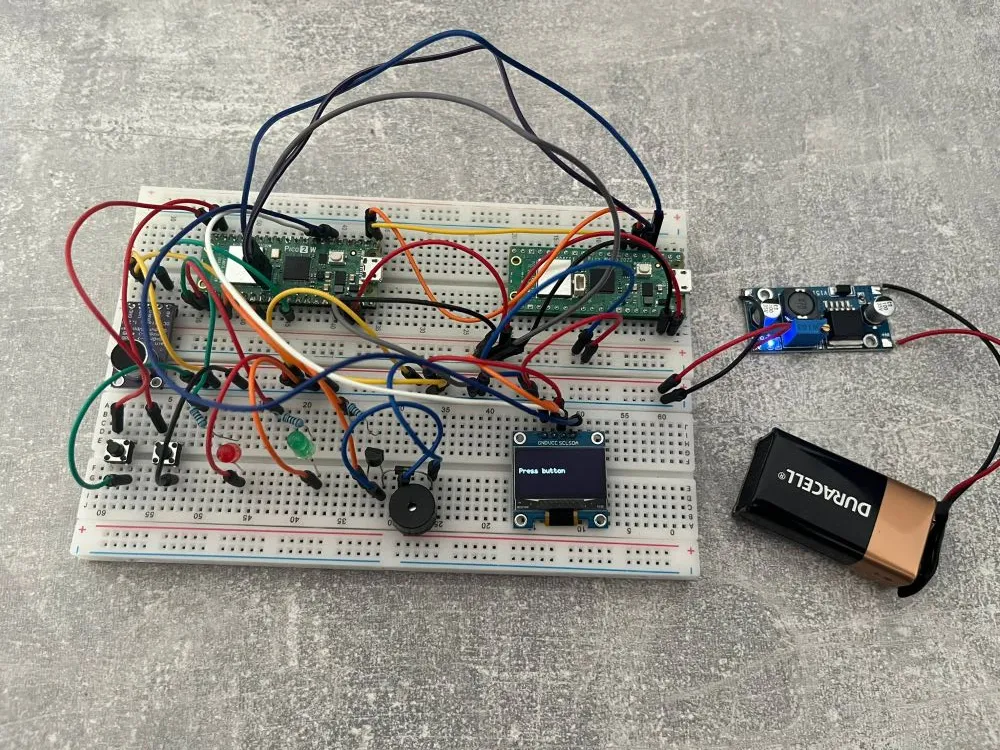
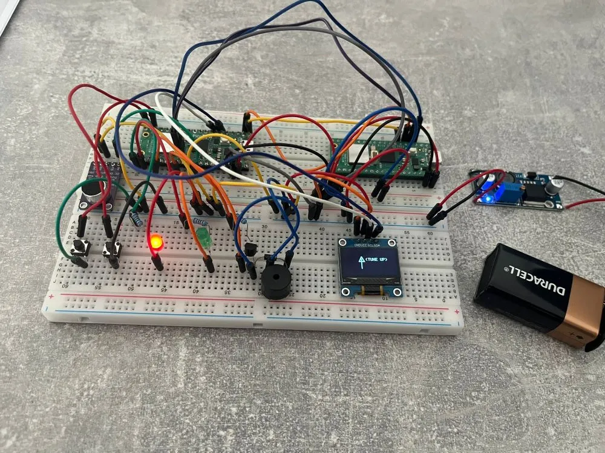
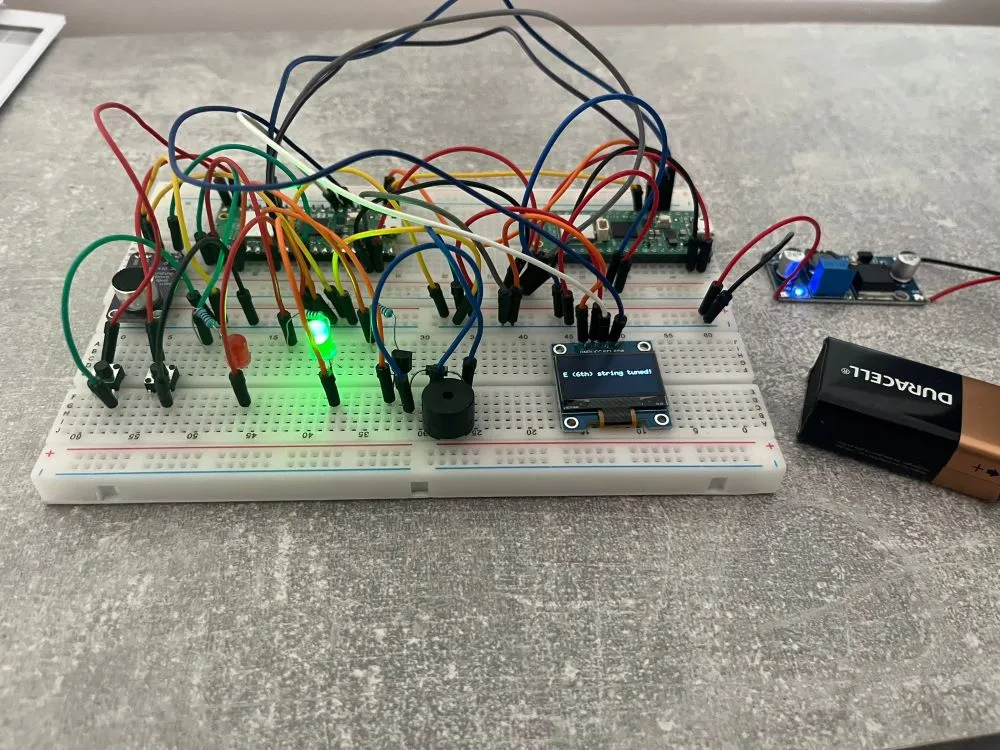
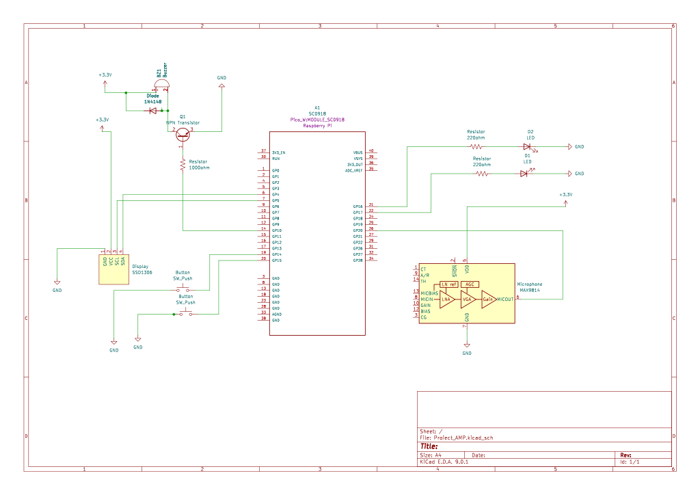

# Guitar Tuner
Used to tune your guitar

:::info
Author: Magureanu Alin \
GitHub Project Link : https://github.com/UPB-PMRust-Students/project-Alin1502
:::

## Description
The project consists of a guitar tuner that helps the user to accurately tune each guitar string without the need for external devices or application. 
Firstly, the sound is captured by the MAX9814 microphone and is sent to the microcontroller. The Raspberry Pi Pico analyzes the signal using Fast Fourier Transform in order to determine the dominant frequency. The obtained frequency is compared to the standard tuning values and identifies the closest musical note. After all the computations, the obtained note is shown on the OLED Display and the buzzer replicates the sound of the chord. For simplicity of the user interface, the user can select which string he is currently tuning using a push button.

## Motivation
As someone who started to play guitar recently, I found it frustrating that my guitar was getting out of tune frequently. While there are mobile apps available for tuning, I disliked the idea of always depending on a phone and internet access to perform this. By researching how to detect sound frequencies, process them and display them in real time, I was able to create my own, fully functional device for tuning the guitar.

## Architecture

1. Raspberry Pi Pico: used for handling the logic of the project. It receives analog audio input from the microphone, makes it digital using ADC and performs signal processing to detect the frequency
2. Microphone Module: captures the sound of the guitar being plucked, which is then sent to the microcontroller
3. OLED Display: displays when the chord is in tune and the current string selected
4. Push Button: prompts the user to select between the 6 chords ( E, A, D, G, B, E) to select what to tune.
5. LED: blinks red when guitar is out of tune, green when it is in tune
6. Buzzer: replicates the sound of the respective chord after it gets in tune

## Log 

### Week 28 April - 4 May
I started working on the documentation for the project. I bought every necessary component and i started to connect them on the breadboard, in order to be able to make the schematics and understand how they interact with eachother.
### Week 5-11 May
This week I started looking into how to use the Fast Fourier Transform (FFT) to detect the frequencies from the microphone. I needed this to figure out which string is being played on the guitar.I learned how to take audio samples, remove the DC offset, and apply the FFT using the microfft crate.
### Week 12-18 May 
I implemented the other components : the push button to select between strings, and the two led's to display the tuning status. I still have issues with computing the correct frequency of each string, as there is a lot of background noise detected. The display is working aswell, displaying if we should tune upwards, downwards or if it's in tune.
### Week 19-25 May 
I succesfully completed the software part of the project. The tuner is now capable to detect accurately the frequency of each guitar string. I also improved the user interface part, providing clear feedback on the display.

## Hardware
1. **Raspberry Pi Pico 2**  
Main control unit. Coordinates all used components - the microphone, the buzzer, the led's and the display. It performs signal processing to analyze the audio input and determine the string's frequency.
2. **MAX9814 Microphone**   
Captures audio. Detects the sound and sends the analog signal to the pico's analog-digital converter.
3. **Push Button**  
User interaction. Allows the user to cycle through guitar strings for tuning and is used to move to the next chord after a string gets tuned.
4. **LED's**  
Visual tuning indicators. When the correct frequency is detected, it means the guitar is in tune and the green led turns on. Otherwise, the red led is constantly turned on during the process.
5. **Active Buzzer**  
Audio feedback. Sounds a confirmation tone when a string is tuned correctly, providing audible confirmation alongside the green LED. The tone of the buzzer coresponds the sounds of the respective string.
6. **OLED Display**  
Display status. Shows messages such as the current string tuned or whether we need to tune up or down.  
7. **Step Down Power Supply**    
Using a battery and the LM2596s, we will power the whole circuit such that it is portable and we can use it anytime

### Schematics

### Bill of Materials
| Device | Usage | Price |
|--------|--------|-------|
| [Raspberry Pi Pico 2W](https://www.raspberrypi.com/documentation/microcontrollers/pico-series.html) | The microcontroller | [40 RON](https://www.optimusdigital.ro/en/raspberry-pi-boards/13327-raspberry-pi-pico-2-w.html?search_query=raspberry+pi+pico+2w&results=36) |
| [Raspberry Pi Pico WH](https://www.raspberrypi.com/documentation/microcontrollers/pico-series.html) | The Debugger | [39 RON](https://www.optimusdigital.ro/en/raspberry-pi-boards/12395-raspberry-pi-pico-wh.html?srsltid=AfmBOopdlNbPIeP-BRNzfXWN6kYsqQZ9dnm39K7uuF7WCxecjr7_kDWq) |
| [MAX9814](https://www.analog.com/media/en/technical-documentation/data-sheets/max9814.pdf) | Microphone Module| [60 RON](https://www.optimusdigital.ro/en/others/1194-electret-microphone-amplifier-max9814-with-auto-gain-control.html?search_query=max9814&results=2) |
| 9V Battery | Power the circuit | [20 RON](https://www.auchan.ro/baterie-duracell-basic-9-v/p) |
| LM2596s Step Down | Power the circuit | [13 RON](https://www.optimusdigital.ro/ro/surse-coboratoare-reglabile/1108-modul-dc-dc-step-down-lm2596hv.html?srsltid=AfmBOorHLepWtNtWwOSHrw3hHI_0m_YPESz5orE_K7NM5NYrv3PAGsWu) |
| Push Button | Select Button | [0.36 RON](https://www.optimusdigital.ro/en/buttons-and-switches/1119-6x6x6-push-button.html?search_query=button&results=491) |
| [OLED Display](https://cdn-shop.adafruit.com/datasheets/SSD1306.pdf) | The Display | [30 RON](https://www.emag.ro/afisaj-oled-ssd1306-oled-i2c-compatibil-arduino-si-raspberry-pi-27x27x4-mm-albastru-c9/pd/D3C7C1YBM/?utm_medium=ios&utm_source=mobile%20app&utm_campaign=share%20product) |
| LED | Blink LED | [0.4 RON](https://www.optimusdigital.ro/en/leds/38-5-mm-green-led-with-difused-lens.html?search_query=led&results=2049) |
| Buzzer | Replicates Sound | [1.4 RON](https://www.optimusdigital.ro/en/buzzers/634-5v-passive-buzzer.html?srsltid=AfmBOop6YS3xvQqrdw4Is5j7eh74mKUJTBTt8pieBJUydFhvGemBlCR0) |
## Software

| Library | Description | Usage |
|---------|-------------|-------|
| [defmt](https://docs.rs/defmt/latest/defmt/), [defmtrtt](https://docs.rs/defmt-rtt/latest/defmt_rtt/) | Efficient Logging | Used for detailed logging and debugging |
| [ssd1306](https://docs.rs/ssd1306/latest/ssd1306/) | Display Library | Used for I2C OLED Display |
| [embassy-rp](https://docs.embassy.dev/embassy-rp/git/rp2040/index.html) | Pico Peripherals | Used for accessing the peripherals|
| [num-complex](https://docs.rs/num-complex/latest/num_complex/) | Complex Numbers Library | Used to compute complex part of fourier |
| [microfft](https://docs.rs/microfft/latest/microfft/) | Fourier Transform Library | Used to compute frequency with fourier  |
| [embassy-time](https://docs.rs/embassy-time/latest/embassy_time/) | Time management library  |Used for time-based operations such as delays |
| [embassy-executor](https://docs.rs/embassy-executor/latest/embassy_executor/) | Async/Await executor  |Used for asynchronous programming and timers |
| [embedded-graphics](https://docs.rs/embedded-graphics/latest/embedded_graphics/) | Text library | Used for text and shapes |
| [heapless](https://docs.rs/heapless/latest/heapless/) | Memory allocation | Used for String |
| [libm](https://docs.rs/libm/latest/libm/) | Math Library | Used for math functions |

## Links
1. [Clap Switch](https://www.instructables.com/Clap-Sensor-With-PICO-2-and-MAX9814/)
2. [Fundamentals and Harmonics](https://www.physicsclassroom.com/class/sound/lesson-4/fundamental-frequency-and-harmonics)
3. [Video Demo for Tuner](https://youtu.be/ZKQ4Tv6Pjqw?si=KDxaxVPkrSLYe49n)
