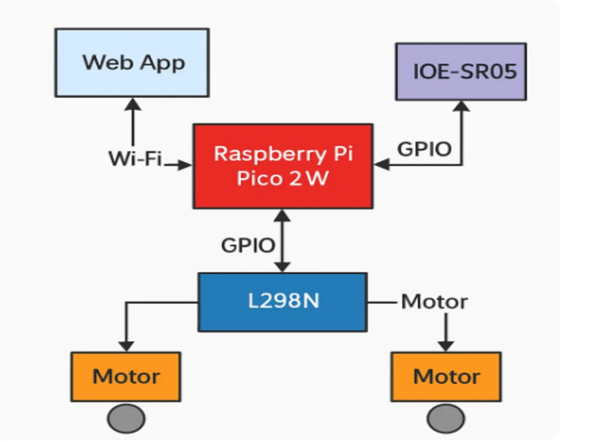

# Smart Ride

Our favourite childhood toys meet modern technology! Smart Ride is an improved remote-controlled car that uses an ultrasonic sensor to map the room!

:::info 

**Author**: Popovici Andra-Raluca

**GitHub Project Link**: https://github.com/UPB-PMRust-Students/project-andra-raluca-pop

:::

## Description
The car is controlled by means of a virtual remote control simulated in a web app. It uses an IOE-SR05 Ultrasonic Sensor to display the distance between the car and obstacles and aims to create a virtual map inside the web app. 

## Motivation

Since I was in primary school, my favourite toys were remote-controlled cars, which I've collected for several years. This project combines my childhood passion with modern technology and aims to make a more interesting, cooler remote control car suitable for all ages!

## Architecture 

##  Components

### 1. Raspberry Pi Pico 2W 
- The brain of the system.
- Handles:
  - Wi-Fi communication using `cyw43` driver
  - TCP server via `embassy-net`
  - GPIO-based control of motors and sensors
  - Real-time task management via `embassy` async runtime

### 2. Web App
- Runs in any browser on the same Wi-Fi network.
- Sends TCP commands to the Pico 2W (`"forward"`, `"backward"`, `"left"`, `"right"`, `"stop"`, `"distance"`, `"map"`).

### 3. Web Server (Rust Firmware on Pico 2W)
- Accepts and parses TCP socket messages.
- Sends movement signals to motors and reads data from sensors.
- Responds with sensor readings or map history when requested.

### 4. Ultrasonic Sensor (IOE-SR05)
- Triggered via GPIO (`PIN_7`) and receives echo on `PIN_6`.
- Measures front-facing distance using echo timing.
- Used for mapping and collision awareness.

### 5. Motor Control (L298N via GPIO)
- Controlled through GPIO (`PIN_2` to `PIN_5`) — no PWM used.
- Logic functions for movement:
  - `forward()` – move ahead
  - `backward()` – move back
  - `left()` / `right()` – turn
  - `stop()` – stop motion

---

## Communication Between Components

The architecture relies on coordinated communication between all components as follows:

| From           | To                  | Medium | Purpose                                         |
|----------------|---------------------|--------|-------------------------------------------------|
| Web App        | Pico 2W             | Wi-Fi  | Send movement/query commands via TCP socket    |
| Pico 2W        | L298N Motor Driver  | GPIO   | Control motor direction (IN1–IN4 logic levels) |
| Pico 2W        | IOE-SR05 Sensor     | GPIO   | Send trigger and read echo (distance)          |
| Pico 2W        | Web App             | TCP    | Reply with sensor or mapping information       |

## Log

### Week 5 - 11 May

After establishing the final form of the project, I started my documentation by gathering information about the required hardware parts and necessary libraries. I configured the setup: I connected the Raspberry Pi Pico 1 for debugging to the target (Raspberry Pi Pico 2W) and used the provided lab repository. I also started working on the hardware pieces by cutting the base structure on which all the components will be glued. Then I connected the 2 DC motors to the L298N module and added their required functions to the code.

### Week 12 - 18 May

This week, I finished the code and functions for the DC motors (final adjustments), created the basic function for the IOE-SR05 sensor and created the web app for the remote control, including the TCP server and http converter. In terms of harware, I finished the setup (wiring, fixing the ball caster that replaces the wheels in the back, fixing the sensor onto the acrylic plate).

### Week 19 - 25 May

During the last week I customised the web app for the remote control, making it user-friendly and visually pleasing. I also finished the mapping logic and function and made the car show it in the web app as well as in the terminal.

## Hardware

The car uses a Raspberry Pi Pico 2W microcontroller that manages motor control and sensor input. I included 2 motors with gearbox and attached wheels that allow movement in 4 directions (left, right, forward, backward) as well as stopping the movement when the user presses the " stop" button.
An IOE-SR05 Ultrasonic sensor is attached in the front and used for distance measurement and mapping. It provides feedback for the user to help avoid obstacles. Finally, for debugging, a Raspberry Pi Pico 1 was as it helped in testing the hardware components and developing the source code.

### Schematics

### Bill of Materials

| Device | Usage | Price |
|--------|--------|-------|
| [Raspberry Pi Pico W](https://www.emag.ro/placa-de-dezvoltare-raspberry-pi-pico-w-cu-wi-fi-rpi-pico-w/pd/DT8H69MBM/) | Main microcontroller with Wi-Fi, runs Rust firmware | 35 RON |
| [Raspberry Pi Pico](https://www.emag.ro/placa-de-dezvoltare-raspberry-pi-pico-raspberrypico/pd/DGSNJ0MBM/) | Used for debugging during development | 25 RON |
| [DC Motor with Gearbox and Wheel](https://www.optimusdigital.ro/en/motors-wheels-and-accessories/2058-dc-motor-cu-reductor-si-roata-65mm.html) x2 | Motion and propulsion | 11.90 RON x2 = 23.80 RON |
| [IOE-SR05 Ultrasonic Sensor](https://www.optimusdigital.ro/en/distance-sensors/1043-ultrasonic-sensor-module-sr04.html) | Room mapping / obstacle detection | 8.90 RON |
| [L298N Motor Driver Module](https://www.optimusdigital.ro/en/motor-drivers/2061-l298n-dual-h-bridge-motor-driver.html) | Controls the motors with PWM and direction signals | 13.90 RON |
| [Breadboard 400 pins](https://www.optimusdigital.ro/en/breadboards/207-breadboard-400-pini.html) x2 | Prototyping and wiring | 7.90 RON x2 = 15.80 RON |
| [Male-to-Male Jumper Wires](https://www.optimusdigital.ro/en/jumpers-and-cables/255-jumper-wire-male-to-male-40pcs.html) | Wiring connections between modules | 4.90 RON |
| [Female-to-Female Jumper Wires](https://www.optimusdigital.ro/en/jumpers-and-cables/254-jumper-wire-female-to-female-40pcs.html) | Wiring connections between modules | 4.90 RON |
| [3.7V Li-ion Rechargeable Battery](https://www.emag.ro/mini-acumulator-li-ion-3-7v-18650-3800mah-skywolfeye-skywolfeye18650/pd/DZZYMYMBM/) x2 | Powers the system (motors and/or controller) | 19.99 RON x2 = 39.98 RON |
| [Transparent Plexiglass Plate](https://www.optimusdigital.ro/en/robotic-accessories/973-plexiglass-board-for-diy-chassis.html) | Chassis base for mounting electronics and wheels | 10.90 RON |

| **Total** |  | **182.98 RON** |

## Software

## Software Libraries

| Library / Crate | Description | Usage Example |
|------------------|-------------|----------------|
| [`embassy-executor`](https://github.com/embassy-rs/embassy/tree/master/embassy-executor) | Async runtime for embedded Rust | Drives async `main` loop |
| [`embassy-rp`](https://github.com/embassy-rs/embassy/tree/master/embassy-rp) | HAL for Raspberry Pi Pico boards | Access GPIOs, peripherals |
| [`embassy-time`](https://github.com/embassy-rs/embassy/tree/master/embassy-time) | Timing and delays | `Timer::after_millis(100).await` |
| [`embassy-net`](https://github.com/embassy-rs/embassy/tree/master/embassy-net) | TCP/IP networking stack | Runs a TCP server |
| [`embassy-usb`](https://github.com/embassy-rs/embassy/tree/master/embassy-usb) | USB support (optional) | USB-related functions (if used) |
| [`cyw43`](https://github.com/embassy-rs/embassy/tree/master/embassy-net-driver/src/cyw43) | Driver for CYW43 Wi-Fi chip on Pico W | Connects to Wi-Fi |
| [`cyw43-pio`](https://github.com/embassy-rs/embassy/tree/master/embassy-net-driver/src/cyw43-pio) | PIO backend used by CYW43 | Enables PIO communication |
| [`defmt`](https://github.com/knurling-rs/defmt) / [`defmt-rtt`](https://github.com/knurling-rs/defmt) | Efficient logging and debugging via RTT | `info!("message")` in terminal |
| [`panic-probe`](https://docs.rs/panic-probe) | Panic handler for embedded Rust | Shows panic messages |
| [`embedded-io-async`](https://github.com/embassy-rs/embedded-io) | Async I/O traits for sockets | Used for `socket.write_all(...)` |
| [`gpio::{Level, Input, Output}`](https://docs.rs/embassy-rp/latest/embassy_rp/gpio/) | Pin control for motors and sensors | Used for motor/sensor pins |
| [`fixed::traits::ToFixed`](https://docs.rs/fixed) | Numeric conversion to fixed-point | Converts float to fixed |
| [`static_cell`](https://docs.rs/static_cell) | Safe global static memory management | Static memory for network stack |

---

## Links

[Masina Bluetooth - Exemplu Proiect PM](https://ocw.cs.pub.ro/courses/pm/prj2022/fstancu/masinabluetooth)

