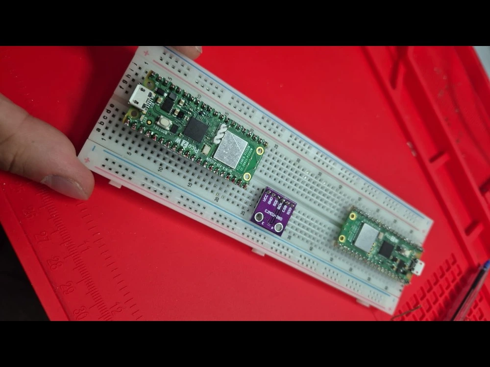
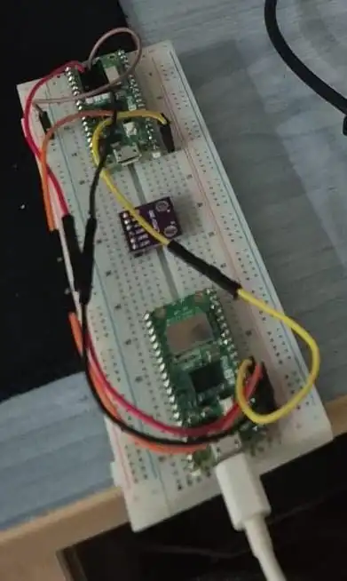
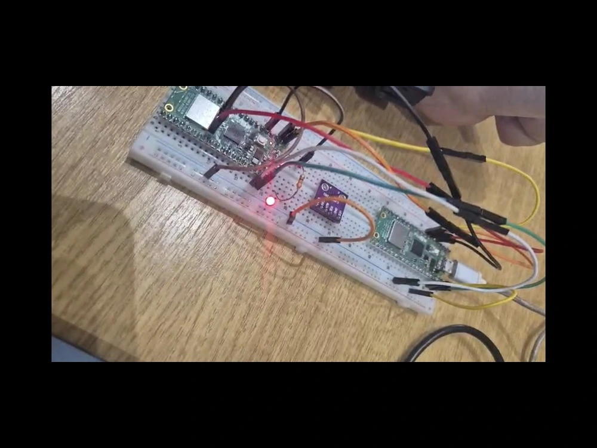
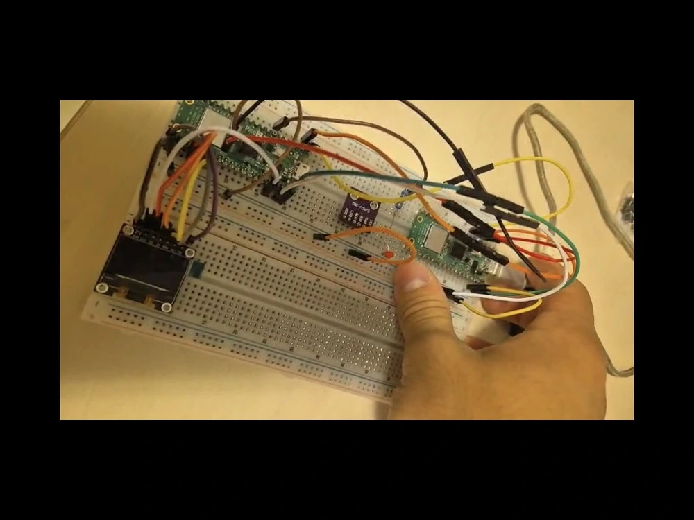
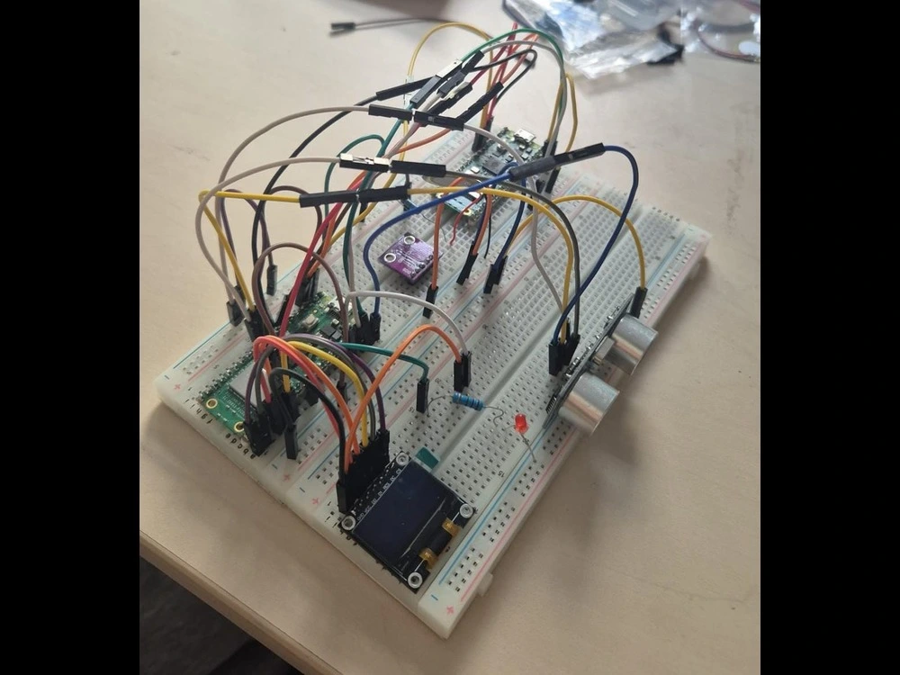
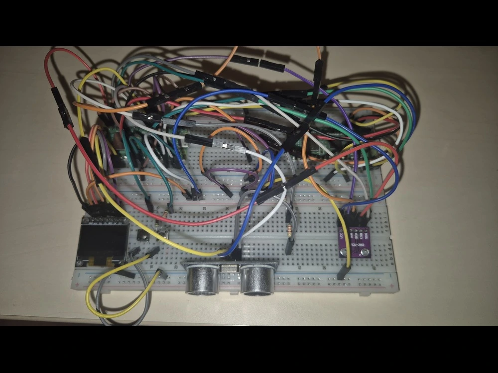
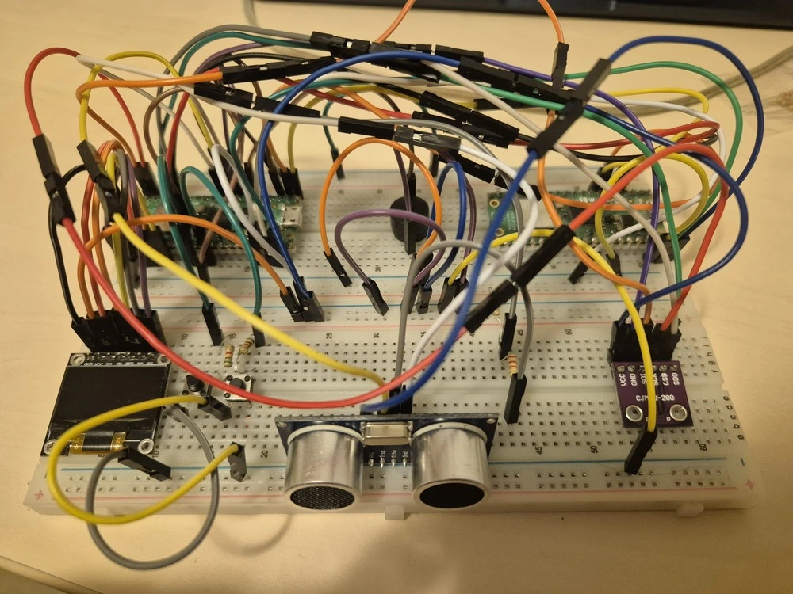
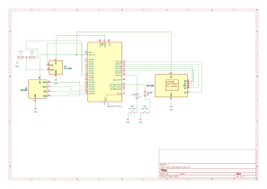

# Rust Desk Assistant
An assistant that helps you focus and keep a good posture when working at a desk while keeping track of some environmental metrics. It comes equipped with the option of setting a timer.

:::info 

**Author**: Voicea David-Alexandru

**GitHub Project Link**: https://github.com/UPB-PMRust-Students/project-VoiceaDavid

:::

## Description

This desk assitant is build using a Raspberry Pi Pico 2W, a humidity and temperature BME280 sensor, an ultrasonic HC-SR04 sensor, an SPI OLED module, two push buttons and a buzzer. The recorded data is sent to the computer via WIFI.

It will record some environmental data (temperature and humdity) from the space the user uses to work from. It also scans the user's position at the desk and in case it changes by a specfic margin, the user will be notified by a buzzer to fix his posture. In case the user wishes to focus on working for a specific time, a timer function is implemented (it is controlled by two push buttons).

## Motivation

I always spend long hours at my desk, whether that is for work or entertainment purposes it varies. The idea is, I would like to have a device that can tell me when I am getting too close or too far from the screen, so I can avoid a bad posture or eye damage. In addition I would like this device to be able to record in real-time the humidity and temperature of my environment, so I know if the space I am using is suitable for long working hours. It would be nice to be able to set a timer on it too.

## Architecture 

### Schematic Diagram

The diagram of the project:

**Raspberry Pi Pico 2W**
- **Role**: Controls and powers every component. It also gets readings from the sensors and displays them on the OLED module, it acts as the core component of the entire project. 
- **Connections**: GPIO for buttons, the buzzer and the HC-SR04 sensor. SPI for the OLED module and BME280 sensor.

**BME280 sensor**
- **Interface**: SPI
- **Role**:  Reads environmental data (humidity and temperature) and sends them back to the pico.
- **Connections**: conected to the Raspberry Pi Pico 2W, SDO -> SPI1 RX, CSB -> SPI1 CSn, SCK -> SPI1 SCK, SDI -> SPI1 TX, Vcc -> 3V3(out), GND -> GND

**SPI OLED module**
- **Interface**: SPI
- **Role**:  Displays the environmental data and alerts if the user gets too close to the HC-SR04 sensor.
- **Connections**: Vcc -> 3V3, Gnd -> Gnd, D0 -> SPI0 SCK, D1 -> SPI0 TX, RES -> GP20, DC -> SPI0 CSn, CS -> SPI0 RX. 

**HC-SR04 sensor**
- **Interface**: GPIO
- **Role**:  Detects the distance between the user and the desk assistant.
- **Connections**: Gnd -> Gnd, Trig -> VBUS, Echo -> GP7 (but using a voltage divider so we're only sending 3.3V to the pico instead of the 5V the VBUS outputs), Vcc -> GP6.

**Buzzer**
- **Interface**: GPIO
- **Role**: Used as an alert for when the user gets too close to the screen or the timer runs out.
- **Connections**: GP5. 

**Buttons**
- **Interface**: GPIO
- **Role**:  Used to increment/decrement the timer by 1 minute.
- **Connections**: GP22 and GP26, each having a 5.1kOhm resistor in series
  
## Log

### Week 5 - 8 May

I souldered the pins on the picos and on the BME280 sensor at the laboratory and flased the debugger and connected it to the other pico.

### Week 6 - 11 May

I connected an LED to the pico and made sure everything works smoothly.

### Week 6 - 12 May

I managed to connect the SPI module to the pico and got it displaying some hardcoded messages.

### Week 6 - 14 May

I connected and got the HC-SR04 sensor working and after many failed attempts it displays the correct distance until the closest object. At this time no connection in the code between the components was made. I was just making sure everything is wired properly and is working as intended. 

### Week 6 - 15 May

During the laboratory I finally connected the BME280 sensor and got it working. Until now it just stayed on the breadboard without being wired to anything. I was surprised to see it working on my first attempt, after having struggled with the HC-SR04 for around two days. (The picture is from the lab)

[picture_bme280](bme280_connection.webp)

### Week 7 - 19 May

After taking a few days' break I got back into work with a simple task at hand: make the components communicate with each other. I had trouble making the buzzer work, as I had used a piezo buzzer until now and it just hated me. I ordered another passive buzzer and until it came I just ignored the piezo buzzer. Other than that, making the sensors communicate with the screen was not that difficult, and now I have actual relevant data being displayed. I also connected the buttons.

### Week 7 - 22 May

The hardware part was completed a few days ago, but I needed my new buzzer and unfortunately I was not able to get it until now. Other than that, I wrote some code for the HC-SR04 sensor, so that if an individual changes his/her position after powering the desk assistant with more than 5 cm, the device will consider this a 'bad posture' and will display a message on the screen. When this happens, the buzzer should also be buzzing, but I have yet to aquire the necessary buzzer.

### Week 8 - 28 May

I aquired the buzzer I was talking about previously and connected it and made it work in the code too. It starts buzzing when the user gets too close or too far from his/her initial position. 

## Hardware

I've used two Raspberry Pi Pico 2 W's, a BME280 sensor to detect the humidity and temperature of the environment, a HC-SR04 ultrasonic sensor to detect the distance to the closest object, an SPI OLED module to display the values, a timer and the necessary messages when the posture of the user changes, 2 buttons setting the timer and a buzzer to attract the user's attention.

### Schematics

### Bill of Materials

| Device                                                  | Usage                        | Price                           |
|---------------------------------------------------------|------------------------------|---------------------------------|
| [2x Raspberry Pi Pico 2W](https://www.optimusdigital.ro/ro/placi-raspberry-pi/13327-raspberry-pi-pico-2-w.html?search_query=%09Raspberry+Pi+Pico+2W&results=26) | The microcontroller | [39.66 RON]|
|[HC-SR04 Ultrasonic Sensor](https://www.optimusdigital.ro/ro/senzori-senzori-ultrasonici/12897-senzor-ultrasonic-hc-sr04-.html?search_query=Senzor+ultrasonic+HC-SR04&results=31) | Detect distance from the device to the user  | 6.49 RON|
|[BME280 Sensor](https://www.optimusdigital.ro/ro/senzori-senzori-de-presiune/5649-modul-senzor-barometric-de-presiune-bme280.html?search_query=bme280&results=6) | Reads the environments' temperature and humidity | 73.99 RON|
|[SPI OLED module](https://www.optimusdigital.ro/ro/optoelectronice-lcd-uri/194-oled-096-.html?search_query=Modul+OLED+SPI+de+0.96%27%27&results=3) | Displays the data | 23.79 RON|
|[Passive Buzzer](https://www.optimusdigital.ro/ro/audio-buzzere/12247-buzzer-pasiv-de-33v-sau-3v.html?search_query=buzzer+pasiv&results=14) | Used to notify the user | 0.99 RON|
|[2x Buttons6x6x6](https://www.optimusdigital.ro/ro/butoane-i-comutatoare/1119-buton-6x6x6.html?search_query=buton&results=212) | Increment/Decrement timer | 2x0.36 RON|
|[3x 5.1k Resistor](https://www.optimusdigital.ro/ro/componente-electronice-rezistoare/853-rezistor-025w-51k.html?search_query=rezistor+5.1k&results=2) | Used for the buttons and for the voltage divider | 3x 0.10 RON|
|[1x 2.2k Resistor](https://www.optimusdigital.ro/ro/componente-electronice-rezistoare/851-rezistor-025w-22k.html?search_query=rezistor+2.2k&results=5) | Acceleration and breaking buttons | 1x 0.10 RON|
|[10x 10cm Female-Female wires](https://www.emag.ro/fire-conexiune-mama-mama-robofun-10-bucati-10cm-00002463-2079/pd/DQ8CPYYBM/) | Male-Female Wires | 4.88 RON |
|[10x 20cm Male-Female Wires](https://www.emag.ro/10-x-fire-dupont-mama-tata-20cm-00002778/pd/DZJ66JBBM/) | Male-Female Wires | 2.36 RON|
|[40x 10cm Male-Male Wires](https://www.optimusdigital.ro/ro/fire-fire-mufate/884-set-fire-tata-tata-40p-10-cm.html?search_query=fire+tata-tata&results=72)| Male-Male Wires | 4.99 RON |

## Software

| Library | Description | Usage |
|---------|-------------|-------|
| [embassy-rp](https://github.com/embassy-rs/embassy) | RP2040 peripheral access | Initializes and interacts with Pico W hardware peripherals |
| [embassy-executor](https://github.com/embassy-rs/embassy) | Async runtime | Runs asynchronous tasks like motor control and input reading |
| [embassy-time](https://github.com/embassy-rs/embassy) | Time utilities | Used for delays, scheduling, and task coordination |
| [embassy-net](https://github.com/embassy-rs/embassy) | Networking stack | Manages TCP/IP over Wi-Fi; used for remote control |
| [embassy-lab-utils](https://github.com/embassy-rs/embassy-lab) | Pico W Wi-Fi helpers | Simplifies Wi-Fi and network stack setup |
| [gpio](https://docs.rs/embassy-rp/latest/embassy_rp/gpio/) | GPIO module | Controls the buttons' and buzzer's pins |
| [ssd1306](https://docs.rs/ssd1306/latest/ssd1306/) | Driver for SSD1306 OLED display | Controls the SPI module |
| [embedded_graphics](https://docs.rs/embedded-graphics-core/latest/embedded_graphics_core/) | Used to render shapes and text | Displays text on the SPI module |
| [hcsr04_async](https://crates.io/crates/hcsr04_async)| Crate for the HC-SR04 | Used for getting the data from the object detection sensor |
| [defmt](https://github.com/knurling-rs/defmt) | Logging framework | For debug messages via RTT/serial |
| [panic-probe](https://docs.rs/panic-probe) | Panic handler | Handles panics with minimal overhead |
| [static_cell](https://docs.rs/static_cell) | Static memory allocation | Safely manages statically allocated Embassy resources |

## Links

1. [Ultrasonic Distance Sensor Tutorial](https://www.youtube.com/watch?v=Xn_oAiH0ZsM)
2. [More about the ultrasonic sensor](https://crates.io/crates/hc-sr04)
3. [Inspiration for connecting and coding SPI Module](https://www.youtube.com/watch?v=A9hsyIYSBs0)
4. [Very helpful information and examples](https://pmrust.pages.upb.ro/docs/fils_en/category/lab)