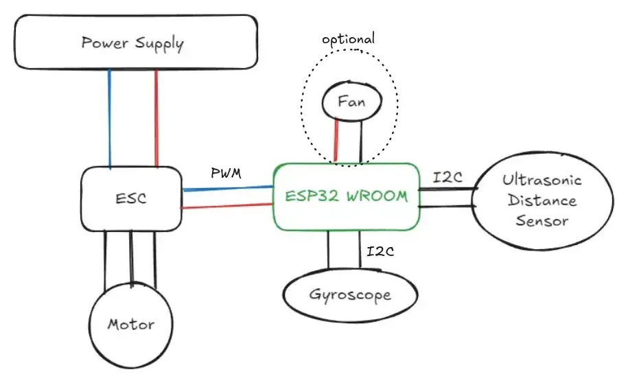
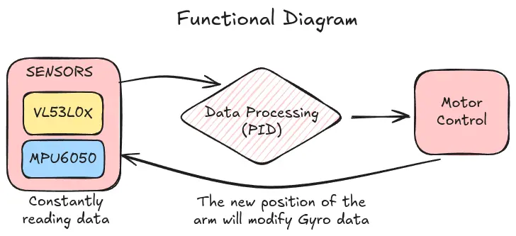

# Educational PID Demonstration
A visual representation of Control System application: a moving arm.

:::info

**Author**: Gabriela-Florentina Alexa \
**GitHub Project Link**: https://github.com/UPB-PMRust-Students/project-Eiline04

:::

## Description

The project I am about to make has the purpose of illustrating PID principles, using an ESP32 WROOM to balance a fan-powered arm. The system consists of a distance sensor used to follow the hand of the user. For educational purposes, I am also going to use a gyroscope in order to get stability feedback. Furthermore, the fan is moved with a brushless motor (which is connected to the microcontroller via an ESC - electronic Speed Controller). Thus, this project has a high impact on demonstrating how a real-time control system works.

## Motivation

My interest in PID control began in high school, when I first used it to optimize the trajectory of an autonomous robot (as I was part of a robotics team). Since then, I've been fascinated by how control systems are applied in everyday life-whether in cars, drones, or even household appliances like thermostats. This project allows me to dive deeper into a topic I find both intellectually challenging and personally rewarding. By combining sensors, real-time feedback, and control algorithms, I aim to better understand and illustrate the principles behind modern automation. I am excited to help the 16 y.o. version of me understand the 'magic' behind the programming tools she had used in high school, but also create a visual representation of a very cool principle, so that others can understand it too.

## Architecture 

The architecture of the system is designed to demonstrate PID control principles in a real-time environment. The main components of the architecture are:

- **Sensor System**: A **distance sensor** detects the user's hand position, acting as the system input.
- **Controller**: An **ESP32 WROOM** microcontroller runs the PID algorithm and processes data from the sensors (gyro and distance sensor).
- **Feedback System**: A **gyroscope** provides real-time orientation data for stability feedback. It will also provide data that can be used to draw informative graphics.
- **Actuator System**: A **brushless motor**, connected to the ESP32 via an **ESC (Electronic Speed Controller)**, adjusts the fan's thrust to balance the arm.
- **Power Supply**: Delivers sufficient current (~20A) to drive the motor. (It has bult-in off swith in case of danger)
- **Cooler**: Makes sure the ESC is not overheating (althought it is very unlikely to heat, as I am going to use 20-30A).

These components are interconnected to form a closed-loop control system that continuously adjusts the fan thrust to maintain balance (to keep the arm at a constant position) based on the data provided by the distance sensor.

## Log

### Week 5 - 11 May

- Assembled the main part of the project: the moving arm. Created a base so that it is easy to take it off if needed.

- Connected the wires and the electrical components.
- Tested each component using suggested test code.
- Something went wrong and the motor stoped working. Opened and tested the ESC individually to diagnose the issue. A transistor had burned due to a small piece of solder (manufacturing flaw :/). The ESC could not be repaired.

- Ordered a new 40A ESC to replace the faulty 30A one. Delivery took longer than expected...
- To safely test the motor, I began using a servo tester. The setup includes only the power source, the ESC, a 1000µF 25V capacitor to filter the current, and the servo tester.

### Week 12 - 18 May
- Studied PID control theory through documentation and online tutorials.
- Uploaded rust on ESP32.
- Attempted to implement a basic PID controller in Rust.
- Connected the new 40A ESC (yay).
- Continued testing the system in parts for safety reasons. Due to the high RPM of the motor and the sharp propeller, I am avoiding full assembly until basic control is achieved.
- Considering 3D printing a support structure for the gyro and maybe the distance sensor as well.

### Week 19 - 28 May

- Initially, I used Windows to develop the project because I thought that if it worked in the labs, it would work now. I couldn't have been more wrong. Many errors occurred and they were difficult to solve.

- I reviewed the theoretical support for this project posted in the Project Description and saw that using WSL was suggested. I managed to free up disk space and install it. Somehow, I accidentally installed two Linux distributions for the same WSL (I'm still learning these things). However, due to disk storage limitations and my laptop's poor performance, I decided to buy a new SSD and install Linux properly.

- Installing Linux (Arch Linux) became another adventure. The latest released version had kernel problems and wouldn't boot (it took me 2 hours to realize the problem wasn't on my end this time).

- Windows somehow corrupted the new SSD and affected its own configuration. I lost all data and couldn't recover anything (even after watching YouTube tutorials about data recovery).
- I had to make a completely fresh start with everything: new project (which was painful), new OS, and new expectations.

- While testing the arm via the servo motor programmer, something strange happened: the ESC became extremely hot and the motor stopped working while making unusual noises.
- I discovered I had short-circuited the motor cables. After fixing this with proper insulation, everything worked fine.

- To use the distance sensor and gyro, I needed the I2C communication protocol. I kept getting errors even when using the basic I2C initialization method from the official documentation.
- Apparently, there was a migration in the official esp-hal repository that changed how I2C was addressed. This took me a while to understand since there were no online issues posted about it yet.

- I independently implemented the VL53L0X, MPU6050, and motor code so I could run and test them separately. Previously I had done this in Arduino, which was easier, but now I'm using full Rust code.

## Hardware

The project uses the following hardware components:

- **ESP32 WROOM**: Core microcontroller for real-time PID control logic.
- **VL53L0X Distance Sensor**: Detects the position of the user's hand (I²C).
- **MPU6050 Gyroscope**: Provides angular velocity and acceleration data for stability feedback (I²C).
- **Brushless Motor (BLDC) + ESC (Electronic Speed Controller)**: Acts as the actuator that drives the fan to balance the arm, controlled via PWM from the ESP32.
- **Cooler (Fan)**: Controlled via a GPIO pin to prevent overheating.
- **Power Source (12V / 20A)**: Powers the ESC -> brushless motor.
- **Physical Frame (wood/cardboard)**: Holds all components and supports the motion of the balancing arm.

## Components and materials - Photos

### Schematics 

### Bill of Materials

| Device | Usage | Price |
|--------|--------|-------|
| [ESP32 WROOM Dev Board](https://sigmanortec.ro/placa-dezvoltare-esp32-cu-wifi-si-bluetooth) | Main microcontroller | 40.00 RON |
| [GY-521 (MPU6050)](https://sigmanortec.ro/Modul-giroscopic-si-accelerometru-3-axe-GY-521-p126016326) | Gyroscope and accelerometer module | 24.16 RON |
| [VL53L0X Time-of-Flight Sensor](https://sigmanortec.ro/Modul-VL53L0X-timp-de-zbor-p126182383) | Measures distance to user's hand | 16.76 RON |
| [ESC 30A](https://sigmanortec.ro/Controller-Motor-ESC-30A-p139673260) | Controls brushless motor | 47.15 RON |
| [ESC 40A](https://www.electronicmarket.ro/ro/product/controller-motor-40a-esc-2-4s) | Controls brushless motor | 46.10 RON |
| [Brushless Propeller Set 6045 CW/CCW](https://sigmanortec.ro/Elice-drona-6045-p139673087) | Attached to motor for thrust | 9.84 RON |
| [Brushless Motor (BLDC)](https://www.emag.ro/motor-brushless-rqiurpn-a2212-kv2200-3-17mm-pentru-drone-diy-22-brushlessmotors/pd/DNJRFSYBM/) | Keeps the hand in needed position. | 45 RON |
| [5V Fan (Raspberry Pi, 3030)](https://sigmanortec.ro/ventilator-5v-raspberry-pi-02a-3030) | Used as a cooler | 8.04 RON |
| [4mm Banana Connector (Female, Red) x3](https://sigmanortec.ro/Mufa-Banana-4mm-Mama-Negru-p209899296) | Power connection | 5.22 RON |
| [4mm Banana Connector (Female, Black) x3](https://sigmanortec.ro/Mufa-Banana-4mm-Mama-Negru-p209899296) | Ground connection | 5.22 RON |
| [4mm Banana Connector (Male, Red) x3](https://sigmanortec.ro/Conector-Banana-4mm-Rosu-p209905097) | Power cable end | 2.94 RON |
| [4mm Banana Connector (Male, Black) x3](https://sigmanortec.ro/Conector-Banana-4mm-Negru-p128736095) | Ground cable end | 2.94 RON |
| [Hinge](physical shop) | Makes the arm mobile. | 8 RON |
| [Capacitor](physical shop) | Current filter. | 2 RON |
| [Servo Programmer](https://www.optimusdigital.ro/ro/altele/1162-tester-pentru-servomotoare.html?gad_source=1&gad_campaignid=19615979487&gclid=Cj0KCQjww-HABhCGARIsALLO6XzU0eiPdqvZNTl-pr_RmSFb-neRpErQ2fZkC3viI5TatsqdWgOR0YMaAjd7EALw_wcB) | Testing the motor. | 10 RON |

**Total estimated cost: ~270 RON**

## Software

## System Overview
The software continuously reads orientation data from an IMU and distance measurements from a time-of-flight sensor, processes this information through a control algorithm, and adjusts motor speeds accordingly.

## Workflow Components

### 1. Sensor Reading
- **MPU6050 IMU**:
  - Provides:
    - Raw accelerometer data (3-axis)
    - Gyroscope rotation rates (3-axis)
- **VL53L0X Time-of-Flight**:
  - Provides millimeter-precise distance measurements (or so it should. It is not as precise as expected).
- **I2C Bus**:
  - Managed by `shared_bus` for multi-sensor communication (so that both distance sensor and gyroscope data are received simultaniously).

### 2. Data Processing
- **IMU Data Fusion**:

    A[Accelerometer] --> C[Complementary Filter]
    
    B[Gyroscope] --> C
    
    C --> D[Stable Orientation]

    (This needs further improvement. i should filter data. Fine-tuning is definetely needed.)

| Library/Crate | Description | Usage in Project |
|--------------|-------------|------------------|
| [`esp-hal`](https://github.com/esp-rs/esp-hal) | Hardware Abstraction Layer for ESP32 | Provides low-level hardware access (GPIO, I2C, PWM, timers) |
| [`defmt`](https://github.com/knurling-rs/defmt) | Efficient embedded logging framework | Used for `info!` debug logging |
| [`vl53l0x`](https://crates.io/crates/vl53l0x) | VL53L0X Time-of-Flight sensor driver | Measures precise distances in mm |
| [`mpu6050`](https://crates.io/crates/mpu6050) | MPU6050 IMU (accelerometer + gyro) driver | Tracks device orientation and movement |
| [`shared_bus`](https://github.com/Rahix/shared-bus) | I2C bus sharing manager | Allows multiple sensors on one I2C bus |
| [`pid`](https://crates.io/crates/pid) | PID controller implementation | Implements the control algorithm for balancing |
| [`esp-backtrace`](https://github.com/esp-rs/esp-backtrace) | ESP-specific backtrace support | Handles panics and crash debugging |
| [`esp-println`](https://github.com/esp-rs/esp-println) | Basic println for ESP devices | Alternative logging output |

## Links

1. [Idea](https://www.instagram.com/reel/DHL0V8ZMKM4/) – From here I have the project idea.
2. [PID Explained](https://www.youtube.com/watch?v=UR0hOmjaHp0) – Useful introduction to PID control.
3. [ESP32 & BLDC Motor](https://www.electronicsforu.com/electronics-projects/wireless-bldc-motor-control-esp32) – Useful tutorial.
4. [impl Rust for ESP32](https://esp32.implrust.com/esp32-intro/pinout.html) – ESP essentials (with rust).
5. [ESC from ESP32](https://esp32.com/viewtopic.php?t=20450) – Understanding how to use ESC in my project.
6. [Migrating](https://github.com/esp-rs/esp-hal/blob/main/esp-hal/MIGRATING-0.22.md) – See what are the latest configuration changes.
7. [BLDC](https://blog.mbedded.ninja/electronics/circuit-design/bldc-motor-control/) – Understanding how BLDC Motor works.
8. [ESP32 I2C Communication](https://randomnerdtutorials.com/esp32-i2c-communication-arduino-ide/) – ESP32 with Multiple I2C Devices.
9. [Motor Control Pulse Width Modulator](https://docs.espressif.com/projects/esp-idf/en/latest/esp32/api-reference/peripherals/mcpwm.htmlc) – Trying to understand how PWM works.

