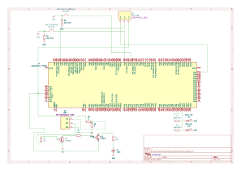

# WaveScope

An embedded device that captures, modulates and filters audio from an electret microphone for signal analysis.

:::info

**Author**: Omer Genan \
**GitHub Project Link**: https://github.com/UPB-PMRust-Students/project-genan2003

:::

## Description

This device is designed for audio signal processing, showcasing two fundamental principles in the field: modulation and filtering. It captures sound from an electret microphone (**MAX4466**) and applies digital signal processing techniques to clean and manipulate the signal. Specifically, it utilizes a biquad filter for frequency-based filtering and a Kalman filter for dynamic noise reduction and signal smoothing. All processing and computations are carried out by the microcontroller unit (**NUCLEO-STM32F767ZI**), which is equipped with a double-precision floating-point unit to efficiently perform mathematical functions using floating-point values. Once processed, the data is transmitted to a computer for visualization, including real-time audio feedback and plotting.

## Motivation

I chose this project because I have always been passionate about control theory and digital signal processing. These fields are fundamental to understanding how we can analyze, modify, and control the signals that surround us in everyday life — from audio and video to data transmission and sensor measurements. I believe it's important for every engineer to understand how signals work and how we can shape them using mathematical tools.

Beyond the technical interest, I see mathematics as a form of art. This project gives me the opportunity to explore that artistic side by offering both visual and audio interpretations of mathematical concepts.

## Architecture


Main components:

- **NUCLEO-STM32F767ZI** will handle all computations and signal processing, then send the processed data via USB to the laptop. This allows the user to both listen to the processed signal (a recording) and view plots to observe the differences before and after processing.
- **MAX4466** will capture sound from the user and send the signal through a GPIO pin with ADC capability. Since it's an analog sensor, the analog signal must be converted into a digital format for processing.

User interface:

- **Button** will be used to manually start the recording, preventing memory overflow that could occur if the board continuously recorded audio.

Feedback:

- **LEDs** will indicate whether the device is currently recording.

## Log

<!-- write your progress here every week -->

### Week 21 April - 28 April

I began by studying how the MAX4466 behaves and tried to find a suitable gain setting for it by connecting it to the board and printing the output values to the terminal.

### Week 28 April - 4 May

I implemented USB data transmission to a Python script that listens to the port where the board is connected. I then tried to analyze how the raw audio from the microphone sounds and also plotted the data received from the microcontroller.

### Week 5 - 11 May

I implemented a Kalman filter and started analyzing the processed data. From what I observe, further processing is necessary. While the Kalman filter performs well, I also want to remove the DC offset in the signal. So, I changed my strategy and added a slow low-pass filter to eliminate the DC offset. This combination currently works well alongside the Kalman filter. However, I still need to work on improving the processing and filtering even further.

### Week 12 - 18 May

After several attempts using only a slow low-pass filter and a tuned Kalman filter, I think it's time to switch to a biquad filter. So, I implemented a biquad filter (a low-pass and a high-pass filter cascaded). I also started using the Kalman filter for smoothing, and the results are better than before. The next step is to analyze the audio signal under varying noise conditions.

### Week 19 - 25 May

After more than 100 code iterations, I’ve finally achieved a solid filter calibration—now with adaptive capabilities. The new setup features an adaptive Kalman filter and a biquad filter. The results are very promising. However, I encountered an issue: residual noise persists even when I'm not speaking. To address this, I implemented a voice activity detection (VAD) system to suppress the noise whenever no speech is detected.

### Week 26 - 29 May

This week, I focused more on noise reduction. I added a noise gate to eliminate additional background noise, but I eventually reached a point where software alone wasn’t enough. To improve the results, I experimented with advanced signal processing techniques, such as spectral analysis and component-level filtering. These approaches improved performance—but only for about two seconds, which isn’t sufficient for my goals.
To push further, I experimented with amplification using integrated circuits, specifically the TDA2822M. However, since it’s designed for stereo audio, it didn’t suit my needs. As a result, I began building my own amplifier using discrete components: the 2N2222 for general-purpose amplification and the A1015 for low-noise audio amplification. I also added a low-pass filter to reduce noise. With this setup, I managed to lower the noise floor from a constant 80mV to around 60mV, as measured with an oscilloscope.

## Hardware


- **NUCLEO-STM32F767ZI** will serve as the main computational and signal processing unit, and will also function as a transmitter to the computer.
- **MAX4466** will act as the sensor from which audio signals will be received.
- **Red Button** will be used to trigger the raw recording.
- **Blue Button** will be used to trigger the processed recording.
- **Blue LED** will provide visual feedback for the timer during the processed recording.
- **Red LED** will provide visual feedback for the timer during the raw recording.
- **Amplifying Circuit with a low-pass filter** used to boost the MAX4466 microphone signal for improved sound clarity, while the added low-pass filter helps reduce high-frequency noise at the output.

### Schematics



### Bill of Materials

<!-- Fill out this table with all the hardware components that you might need.

The format is
```
| [Device](link://to/device) | This is used ... | [price](link://to/store) |

```

-->

| Device                                                                                                                                                                                                                                                                                                                                                                | Usage                                   | Price                                                                                                                                                                             |
| --------------------------------------------------------------------------------------------------------------------------------------------------------------------------------------------------------------------------------------------------------------------------------------------------------------------------------------------------------------------- | --------------------------------------- | --------------------------------------------------------------------------------------------------------------------------------------------------------------------------------- |
| [NUCLEO-STM32F767ZI](https://www.st.com/en/microcontrollers-microprocessors/stm32f7-series/documentation.html)                                                                                                                                                                                                                                                        | The microcontroller                     | [113.26 RON](https://ro.mouser.com/ProductDetail/STMicroelectronics/NUCLEO-F767ZI?qs=7UaJ5Mrpeu0%2F%252BMRranB3%2Fw%3D%3D)                                                        |
| [MAX4466](https://cdn-shop.adafruit.com/datasheets/MAX4465-MAX4469.pdf)                                                                                                                                                                                                                                                                                               | Microphone                              | [8.54 RON](https://sigmanortec.ro/modul-microfon-max4466-cu-amplificare-castig-reglabil-23-5vdc)                                                                                  |
| [Buttons](https://www.optimusdigital.ro/ro/butoane-i-comutatoare/1114-buton-cu-capac-rotund-rou.html)                                                                                                                                                                                                                                                                 | Controlling the recording               | [1.99 RON](https://www.optimusdigital.ro/ro/butoane-i-comutatoare/1114-buton-cu-capac-rotund-rou.html)                                                                            |
| [LEDs and resistors](https://www.optimusdigital.ro/ro/kituri-optimus-digital/9517-set-de-led-uri-asortate-de-5-mm-si-3-mm-310-buc-cu-rezistoare-bonus.html?search_query=leduri&results=59)                                                                                                                                                                            | Indicator for the recording             | [26.99 RON](https://www.optimusdigital.ro/ro/kituri-optimus-digital/9517-set-de-led-uri-asortate-de-5-mm-si-3-mm-310-buc-cu-rezistoare-bonus.html?search_query=leduri&results=59) |
| [Wires female-male](https://www.optimusdigital.ro/ro/fire-fire-mufate/878-set-fire-mama-tata-40p-30-cm.html?search_query=fire&results=429)                                                                                                                                                                                                                            | Connecting the components               | [9.99 RON](https://www.optimusdigital.ro/ro/fire-fire-mufate/878-set-fire-mama-tata-40p-30-cm.html?search_query=fire&results=429)                                                 |
| [Transistors](https://ro.mouser.com/c/ds/semiconductors/discrete-semiconductors/transistors/)                                                                                                                                                                                                                                                                         | Amplifying the singnal from the MAX4466 | [24.99 RON](https://www.optimusdigital.ro/en/kits/10953-plusivo-kit-de-tranzistoare-bipolare-asortate-cu-rezistoare-bonus-210-buc.html)                                           |
| [Ceramic capacitors](https://eu.mouser.com/c/passive-components/capacitors/ceramic-capacitors/?utm_id=22426705326&utm_source=google&utm_medium=cpc&utm_marketing_tactic=emeacorp&gad_source=1&gad_campaignid=22433169554&gbraid=0AAAAADn_wf0ZdyyOcICh8MDr1BPW5FBY9&gclid=CjwKCAjw6NrBBhB6EiwAvnT_roMnQes1ckYiYxQ1MKr5j1SimwMA3g9fs6aEU6PBeOfNkT-0ojqwmRoCid8QAvD_BwE) | Making the analog fiter                 | [19.99 RON](https://www.optimusdigital.ro/en/capacitors/12632-ceramic-capacitor-assorted-kit-30-kinds-from-2pf-01uf.html?search_query=capacitor&results=265)                      |

## Software

| Library                                                | Description                                                                                                                                                | Usage                                       |
| ------------------------------------------------------ | ---------------------------------------------------------------------------------------------------------------------------------------------------------- | ------------------------------------------- |
| [embassy-stm32](https://github.com/embassy-rs/embassy) | Async Rust embedded framework                                                                                                                              | Used for interacting with the peripherals   |
| [bytemuck](https://crates.io/crates/bytemuck)          | A crate for mucking around with piles of bytes.                                                                                                            | Used for safe casting                       |
| [libm](https://crates.io/crates/libm)                  | A Rust implementations of the C math library.                                                                                                              | Used in the computations in filtering       |
| [defmt](https://crates.io/crates/defmt)                | Highly efficient logging framework that targets resource-constrained devices, like microcontrollers.                                                       | Used in displaying on screen and debugging. |
| [static-cell](https://crates.io/crates/static_cell)    | Provides a no-std-compatible, no-alloc way to reserve memory at compile time for a value, but initialize it at runtime, and get a 'static reference to it. | Used for saving memory.                     |

## Links

<!-- Add a few links that inspired you and that you think you will use for your project -->

1. [NUCLEO-F767ZI pinout](https://os.mbed.com/platforms/ST-Nucleo-F767ZI/)
2. [Kalman filter](https://web.mit.edu/kirtley/kirtley/binlustuff/literature/control/Kalman%20filter.pdf)
3. [Biquad filter in Matlab](https://www.mathworks.com/help/dsphdl/ref/biquadfilter.html)
4. [Control Theory Tutorial Basic Concepts Illustrated by Software Examples](https://library.oapen.org/bitstream/id/ca08ee4d-3639-43d0-81b7-f53ebdfd1e03/1002170.pdf)
5. [Digital Signal Processing](https://www-elec.inaoep.mx/~jmram/Digital_Signal_Processing__LI_TAN.pdf)
6. [How does an Amplifier Work? (Class-A)](https://www.youtube.com/watch?v=dKTbrZMscpM)
7. [The Embedded Rust Book](https://docs.rust-embedded.org/book/)
