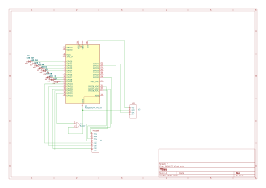
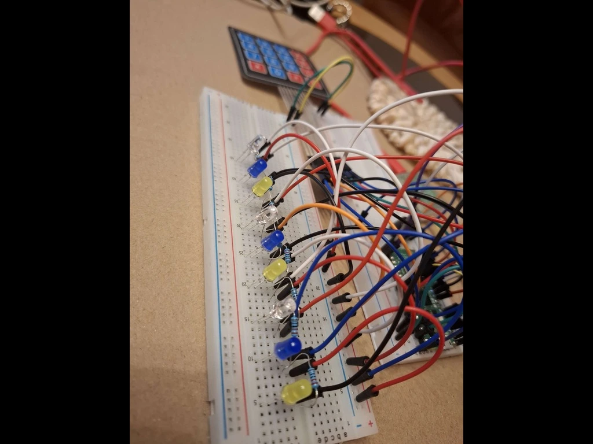
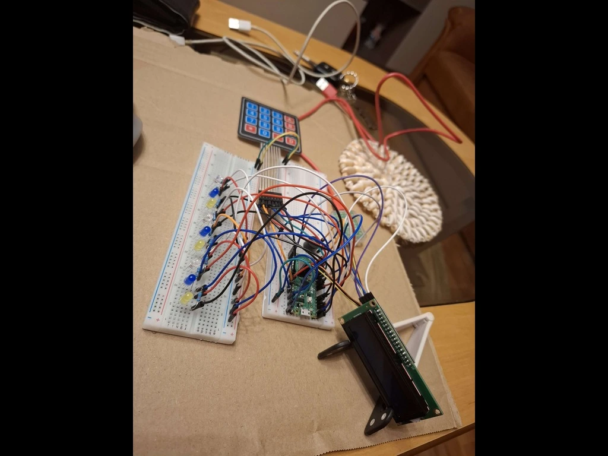
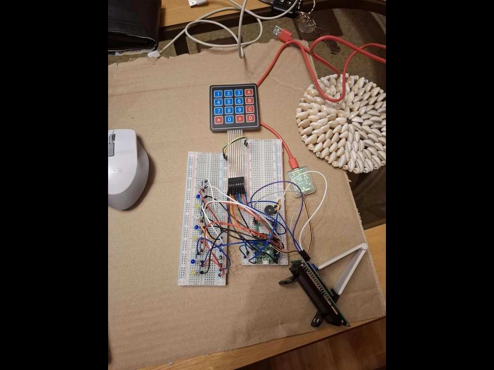

# Project Name

**Simon Says Game - Memory Challenge**

:::info

**Author:** Apostol George-Robert \
**GitHub Project Link:**: https://github.com/Apostol-Robert/AMPproject

:::

## Description

An interactive memory game where players must remember and replicate increasingly complex sequences of lights on a 3x3 LED grid, using a keypad for input and a buzzer for audio feedback. The game gets harder with every step, and ends when the player makes a mistake. 

Also, in my childhood I played a game like this, and I actually find it interesting to now be able to build one of the games I used to play when I was little. 

Additionally, a web interface accessible via WiFi will display real-time scores, enabling players to track progress or compare results on the same network. 

## Motivation

I chose this project because I wanted to combine hardware interaction with Rust programming in a fun and visually engaging way. It’s also a good challenge for working with input devices, output displays, and real-time feedback.

Moreover, integrating a WiFi-connected web interface gives the project a modern touch, making it accessible and interactive beyond the physical device.

## Architecture

* **Game Engine (Rust)** – manages LED sequence generation, user input validation, scoring, and game flow
* **Input Module** – receives keypad input
* **Output Module** – controls LEDs, buzzer sounds, and optional LCD display
* **Random Generator** – provides a new sequence every game
* **Feedback System** – audio (buzzer) + optional text (LCD)
* **Web Server Module** – serves a minimal website over WiFi where the current game score and history are displayed
* **Game Controller** – coordinates everything (input, output, logic, WiFi)

```
Keypad ─┬─> Input Parser
        │
        ├─> Game Logic <── Random Generator
        │        │
        ▼        ▼
     LED Grid  Buzzer + LCD
                     │
                     ▼
             Web Server Module ──> Web UI
```

## Log

### Week 28 Apr - 4 May

During this week, I purchased all the necessary components for the project, including the Raspberry Pi Pico W, 4x4 keypad, LEDs, buzzer, jumper wires, and breadboards. I also finalized the game concept and documented the rules for how the Simon Says game will work. In addition, I designed an initial schematic for organizing the hardware components and planned how the modules (input, output, game logic) will interact. I also decided to build a WiFi-connected web interface to display players' scores.

### Week 5 - 11 May
During this week, I started connecting the main hardware components on the breadboards. I performed initial tests to verify that each module was functioning properly. The Raspberry Pi Pico W was successfully powered and programmed, and I confirmed that it could control the LEDs through GPIO pins.
I also tested the buzzer, and I was able to display simple text on the LCD screen. Additionally, I connected the 4x4 keypad and verified that key presses were correctly detected in software.
These tests helped ensure that all components were working individually, preparing the ground for integrating them into the full game logic in the next development stages.

### Week 12 - 18 May
This week, I completed about 90% of the hardware assembly and wiring. All major components—the Pico W, LEDs, buzzer, keypad, and LCD—are connected and functioning together reliably.
Additionally, I finalized the KiCad schematic for the entire circuit, which accurately reflects the physical connections made on the breadboards. This schematic will be useful for future reference and for designing a possible PCB version.
With the hardware mostly complete, I am ready to focus more on software integration and game logic development in the coming weeks.

### Week 19 - 25 May
This week, I finalized the code implementation for the core game logic, ensuring that all interactions between the input devices, LED sequences, and the LCD display were functioning smoothly. After completing the main coding phase, I performed several small refinements to improve responsiveness and fix minor issues that appeared during testing.

In addition to the software progress, I enhanced the game’s visual feedback by adding two status LEDs: a green LED that lights up when the player advances to the next round, and a red LED that turns on when the player loses. These provide immediate and intuitive feedback for the game’s progression.

I also focused on completing the physical design of the project. I enclosed the wiring and hardware components neatly inside a protective case to enhance both aesthetics and durability. I added a few visual touches—such as coloring and organizing the layout—to give the project a cleaner, more polished look. With both the technical and design aspects now complete, the game is fully functional and ready for presentation or further testing.


## Hardware

The components are arranged across two breadboards to keep the control logic and output interfaces organized and accessible. At the core of the system is the Raspberry Pi Pico W, which manages all input, output, and game logic.
The visual feedback is provided by 9 individual LEDs arranged in a single row. Each LED is directly connected to a separate GPIO pin on the Pico, allowing the game to display sequences that the player must memorize and repeat.
User input is handled via a 4x4 membrane keypad, which is connected through GPIO pins. The keypad is scanned using standard row-column logic to detect button presses efficiently without requiring 16 separate pins.
A passive buzzer is used to generate audio signals for correct inputs, mistakes, or new levels. It’s driven by a PWM-capable pin, enabling the use of different tones for different types of feedback.
Additionally, an LCD display is included to show the player's current score during gameplay. This provides real-time information directly on the device, improving the game experience without the need for an external display.
All connections are made using jumper wires, and resistors are used where necessary—for example, for LED current limiting or to stabilize keypad signals.

### Schematics



 
 
 
 


### Bill of Materials

| Device                                                                                                                                          | Usage                       | Price    |
| ----------------------------------------------------------------------------------------------------------------------------------------------- | --------------------------- | -------- |
| [Raspberry Pi Pico W](https://www.optimusdigital.ro/en/raspberry-pi-boards/12394-raspberry-pi-pico-w.html)                                      | Main microcontroller        | 35 RON   |
| [Breadboard 830 points](https://www.optimusdigital.ro/en/breadboards/13244-breadboard-175-x-67-x-9-mm.html)                                     | For LED matrix and keypad   | \~15 RON |
| [Breadboard 830 points](https://www.optimusdigital.ro/en/breadboards/13244-breadboard-175-x-67-x-9-mm.html)                                     | For Pico, buzzer and wiring | \~15 RON |
| [4x4 Keypad Matrix](https://www.optimusdigital.ro/ro/senzori-senzori-de-atingere/470-tastatura-matriceala-4x4-cu-conector-pin-de-tip-mama.html) | Main input method           | \~7 RON  |
| LEDs (9x)                                                                                                                                       | Visual output               | \~5 RON  |
| [Buzzer](https://www.optimusdigital.ro/ro/audio-buzzere/12247-buzzer-pasiv-de-33v-sau-3v.html)                                                  | Audio feedback              | \~1 RON  |
| Jumper wires                                                                                                                                    | Wiring between components   | \~5 RON  |

## Software

| Library                                                             | Description                | Usage                                         |
| ------------------------------------------------------------------ | -------------------------- | --------------------------------------------- |
| [embassy-rp](https://github.com/embassy-rs/embassy)                | HAL for RP2040             | GPIO, I2C, delays, keypad, LEDs, buzzer       |
| [embassy-executor](https://github.com/embassy-rs/embassy)          | Async executor             | Runs the main asynchronous task               |
| [embassy-time](https://github.com/embassy-rs/embassy)              | Time and delays            | Non-blocking delays and timers                |
| [hd44780-driver](https://github.com/rahix/hd44780-driver)          | LCD 16x2 driver            | Displays messages and score via I2C LCD       |
| [heapless](https://github.com/japaric/heapless)                    | No-std data structures     | Fixed-size vector for storing LED sequences   |
| [defmt](https://github.com/knurling-rs/defmt)                      | Lightweight logging        | For debug output via RTT                      |
| [panic-probe](https://github.com/knurling-rs/panic-probe)          | Panic handler              | Reports panics via probe-run                  |
| [embedded-hal](https://github.com/rust-embedded/embedded-hal)      | Hardware abstraction layer | Common interface for GPIO, I2C, etc.          |
| [static_cell](https://github.com/embassy-rs/embassy)               | Safe static allocation     | Required for long-lived peripheral objects    |
| [rand](https://github.com/rust-random/rand)                        | Random number generator    | Generates LED sequences using simple RNG      |

## Links 
YOUTUBE VIDEOU WITH THE PROJECT: https://youtu.be/1X4oeht5MeU?si=eudbOGlTsnwWPsCv
examples: https://www.youtube.com/watch?v=QfDFu5Kz6N4 
my inspiration: https://www.youtube.com/watch?v=lzvy8HanLNE
