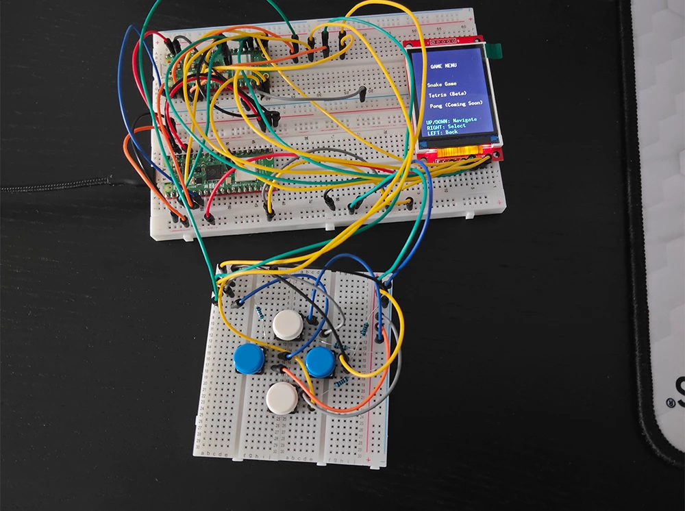
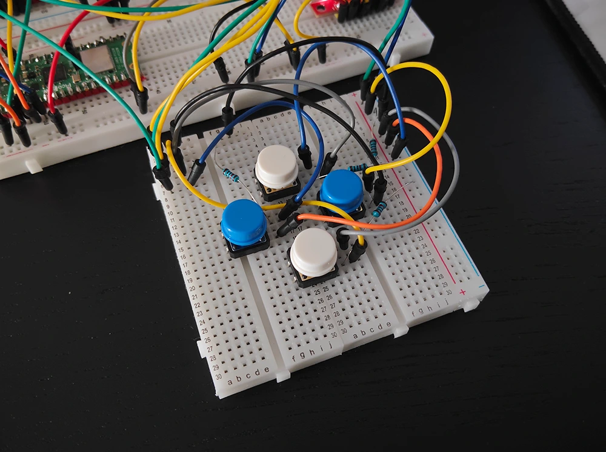
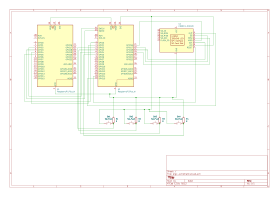

# Portable Retro Gaming Console

:::info 

**Author**: Illia Kucherenko

**GitHub Project Link**: [link to github](https://github.com/UPB-PMRust-Students/project-illia-kucherenko)

:::

## Description

It's a portable gaming console that will run some retro games that used to be popular back in the day. It is built using 2 RP pico 2w, an LCD Display, 4 buttons for controls and LEDs for visual feedback.

## Motivation

I've always been passionate about games and it remains a big part of my life even today. I decided to make something fun that would bring that childish joy we all crave for. I plan on implementing games like Pac-Man and Snake for now, if I succeed, I will try implementing more games.

## Architecture 

Architectural Diagram:

**Raspberry RP Pico 2W (Debugger)**
-Used to flash firmware to processing RP Pico 2W and debug in case of issues.
-Connects to the PC via micro-usb cable and to processing PR Pico 2W via debug interface  

**Raspberry RP Pico 2W (Processing)**
-Runs flashed firmware and acts as a main processing unit for the whole model. Reads data from buttons, controls LCDs, sends and updates image on an LCD, runs firmware with games and games themselves.

**LEDs**
-Used to add visual feedback to whats going on on the screen
-Connected via gpio pins to processing RP Pico 2W

**Buttons**
-Used for controls in menus and games
-Connected via gpio pins to processing RP Pico 2W

**LCD**
-Used to display the image (menus, games etc.)
-Connected via spi interface to processing RP Pico 2W

## Log
### Week 5 - 11 May
I've acquired all the necessary hardware, which is likely still subject to be rethought and changed. I've set up a configuration with two Pico 2Ws, one of them being a debugger for another one. Currently I'm in the process of getting LCD to work and looking for suitable libraries and crates for the project.

### Week 12 - 18 May
I managed to implement a basic version of Snake Game. Although initially it was choppy due to optimisation flaws in screen updates, I managed to fix it and the game now runs at buttery smooth 60 fps. The console is fully functional, but barebones and a little wonky to use for now. For now my plan is to add new gameplay features to the game which are not currently present, and add LEDs for visual feedback. Since I haven't done that yet my KiCad schematic doesn't include RGB LEDs, in the next weekly log I'll make sure to include that as well, as the project will reach a more finished and polished state.

### Week 19 - 25 May
I moved buttons to a separate breadboard which is connected to the main one on order to make a more "d-pad" like controls layout. I implemented Tetris, which is still in beta. So far I encountered 0 unfixed issues but in case if I do I will try to fix them. For Snake Game I added 2 types of rare items: Golden Apples and Diamonds. Golden Apples generate on the field every 10 seconds with odds being 50%, Diamonds on the other hand can spawn with a chance of 25% every 10 seconds, while also moving. Golden Apples give 10 points and Diamonds give 20, Unlike the regular Apple which gives only 1. I also added difficulties to Snake Game: Easy, Normal, Hard, Nightmare. Each affect game's speed, the higher the difficulty - the faster the game is.

## Hardware
Consists of RP Pico 2W (2x), LCD TFT 2.2" module, buttons and resistors and 2 breadboards to hold everything together. At the moment buttons and resistors are not installed due to design concerns.

### Schematics
Here's a KiCad schematic for the current version of the console:

### Bill of Materials

| Device | Usage | Price |
|--------|--------|-------|
| [Raspberry Pi Pico 2W (2x)](https://www.raspberrypi.com/documentation/microcontrollers/pico-series.html) | Microcontroller | [39.66 RON](https://www.optimusdigital.ro/en/raspberry-pi-boards/13327-raspberry-pi-pico-2-w.html?srsltid=AfmBOoo5CQdoi14-RbmA_YJJrNUG1hPBzlSKgPdCOYv9U2PgJdK3bPwM)|
| LCD SPI 2,2 '' 240x320 PX (1x) | LCD Screen | [59.99 RON](https://www.optimusdigital.ro/ro/optoelectronice-lcd-uri/1260-lcd-spi-22-240x320-px.html)|
| Wire Kit(2x) | Wires | [7.99 RON](https://www.optimusdigital.ro/ro/fire-fire-mufate/12-set-de-cabluri-pentru-breadboard.html)|
| Resistor Kit (1x) | Resistors | [14.99 RON](https://www.optimusdigital.ro/ro/componente-electronice-rezistoare/10928-plusivo-kit-250-buc-rezistoare.html) |
| Breadboard (2x) | Breadboards | [19.96](https://www.optimusdigital.ro/ro/prototipare-breadboard-uri/8-breadboard-830-points.html) |
| White Capped Buttons (4x) | Buttons | [1.99 RON](https://www.optimusdigital.ro/ro/butoane-i-comutatoare/1115-buton-cu-capac-rotund-alb.html) |
| Common Cathode RGB (3x) | RGB LEDs | [0.99 RON](https://www.optimusdigital.ro/ro/optoelectronice-led-uri/483-led-rgb-catod-comun.html?search_query=rgb&results=121) |

## Software

| Library | Description | Usage |
|---------|-------------|-------|
| [embassy-rp](https://docs.embassy.dev/embassy-rp/git/rp235xb/index.html) | Hardware abstraction for Raspberry Pi Pico (GPIO, SPI, etc.) | Used for GPIO, SPI, and board initialization |
| [embassy-executor](https://docs.embassy.dev/embassy-executor/git/cortex-m/index.html) | Async runtime for embedded systems | Runs the async main loop and tasks |
| [embassy-time](https://docs.embassy.dev/embassy-time/git/default/index.html) | Async timers and delays | Used for frame timing and delays |
| [embassy-sync](https://docs.embassy.dev/embassy-sync/git/default/index.html) | Mutexes and synchronization primitives | Used for sharing SPI bus safely |
| [embassy-embedded-hal](https://docs.embassy.dev/embassy-embedded-hal/git/default/index.html) | Embedded HAL traits and shared bus support | Used for SPI device abstraction |
| [ili9341](https://docs.rs/ili9341/0.6.0/ili9341/) | Driver for ILI9341 TFT LCD displays | Used for rendering graphics on the LCD |
| [display-interface-spi](https://docs.rs/display-interface-spi/latest/display_interface_spi/) | SPI interface abstraction for displays | Used to connect the display driver to SPI |
| [embedded-graphics](https://docs.rs/embedded-graphics/0.8.1/embedded_graphics/) | 2D graphics library for embedded devices | Used for drawing shapes, text, and game graphics |
| [defmt](https://github.com/knurling-rs/defmt) | Efficient logging for embedded | Used for debug output |
| [defmt-rtt](https://github.com/knurling-rs/defmt) | RTT backend for defmt logging | Used for debug output over RTT |
| [panic-probe](https://docs.rs/panic-probe/latest/panic_probe/) | Minimal panic handler for embedded | Handles panics safely in embedded context |

## Links

1. [link](https://www.youtube.com/watch?v=SB3qwe6CTjM)