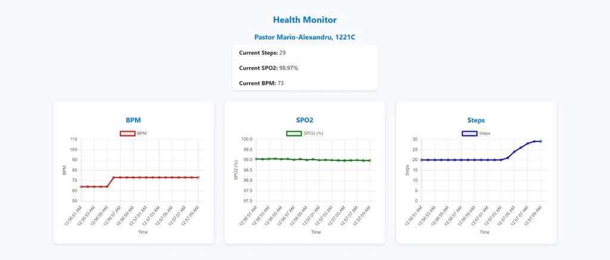
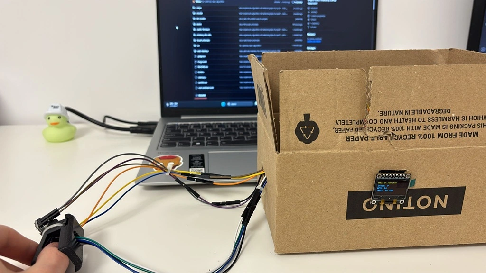

# Health Monitor
A wearable device that tracks heart rate, blood oxygen saturation, and step count in real-time.

:::info 

**Author**: PASTOR Mario-Alexandru \
**GitHub Project Link**: https://github.com/UPB-PMRust-Students/project-l00tus

:::

## Description

This wearable health monitor continuously measures and displays the user's vital signs in real time. It uses a MAX30102 pulse oximeter sensor to calculate heart rate (BPM) and blood oxygen saturation (SpO₂), alongside an ADXL345 accelerometer to detect and count steps. The collected data is displayed on a compact SSD1306 screen, providing a clear and minimal interface. Additionally, a web application fetches the latest sensor readings from the device, displaying the latest sensor reading and three charts that show the evolution of the measured parameters.

## Motivation

I chose this project because I wanted to develop something that integrates both hardware and software in a meaningful way. I was especially motivated by the idea of building something that could have real-life applicability, so I decided to build a wearable health monitor, which felt like a good balance between technical challenge and practical usefulness.

## Architecture

### Schematic Diagram

### Components Overview

- **2x Raspberry Pi Pico 2W**:
    - one used as a debugger
    - one used to control the sensors and display
- **ADXL345 Accelerometer**: used to measure step count through 3-axis acceleration data
- **MAX30102**: used to measure heart rate and blood oxygen level by detecting changes in light absorption from red and IR LEDs using a photoplethysmography sensor 
- **SSD1306**: used to display real-time sensor data like the heart rate, SpO₂, and step count on an OLED screen

## Log

### Week 21 - 27 Apr
After my project got approved, I looked for the necessary hardware and software parts. After deciding on the parts, I ordered them.

### Week 28 - 4 May
I started to assemble the parts on the breadboards in order to test each component. I managed to read the data on all three axes of the accelerometer, to determine the heart rate and SpO₂ from the pulse oximeter, and to print the informations in the terminal. Additionally, I tested the screen.

### Week 5 - 11 May
I successfully implemented and tested the algorithm for step count detection using the accelerometer. Additionally, I wrote the code for displaying all the collected data (step count, heart rate, SpO₂) on the screen.

### Week 12 - 18 May
I consulted with my lab teacher regarding the 3D casing for the sensors, and we concluded that designing a separate case for each sensor would be more efficient. For the pulse oximeter, I used [a pre-existing 3D finger clip found online](https://www.thingiverse.com/thing:4395147). The next step is to drill holes in the case to allow the wires to pass through properly.

### Week 19 - 25 May
I managed to drill a hole in the finger clip so that the wires of the sensor can pass through it, and I stuck the accelerometer to the finger clip.
For the software part, I implemented a separate task that handles the TCP connection, and I tested sending the latest sensor reading.
I started working on the web interface, which will display the data and chose Python with Flask for it.

### Week 26 - 30 May
I finished the Python script, which handles fetching the data from the device over TCP, and I worked on the visual appearance of the website.
I tested to see if the web interface works while wearing the device (and it does).
Additionally, [I recorded myself testing the device](https://www.youtube.com/shorts/hYQXQnslOnA).

## Hardware

My project is built around the Raspberry Pi Pico 2W microcontroller, which collects and processes data from two sensors. An ADXL345 accelerometer is used to detect motion and count steps by measuring the changes in acceleration, while the MAX30102 pulse oximeter sensor measures heart rate and blood oxygen levels by detecting changes in light absorption due to blood flow. The SSD1306 OLED display shows in real time the health metrics of the user. 
This is what the hardware looks like. I 3D printed a finger case for the pulse oximeter, and I used double-sided adhesive tape to stick the accelerometer to the case. I put the breadboard in a box, leaving only the screen on the side of it, and I made a hole for the sensor wires.

### Schematics

### Bill of Materials

| Device | Usage | Price |
|--------|--------|-------|
| [2x Raspberry Pi Pico 2W](https://www.raspberrypi.com/documentation/microcontrollers/raspberry-pi-pico.html) | The microcontroller and the debugger | [2 x 40 RON](https://www.optimusdigital.ro/en/raspberry-pi-boards/13327-raspberry-pi-pico-2-w.html) |
| [ADXL345](https://www.analog.com/media/en/technical-documentation/data-sheets/adxl345.pdf) | Accelerometer for detecting and counting steps | [13 RON](https://www.optimusdigital.ro/en/inertial-sensors/97-adxl345-tripple-axis-accelerometer.html) |
| [MAX30102](https://www.analog.com/media/en/technical-documentation/data-sheets/max30102.pdf) | Pulse oximeter and heart rate sensor | [13 RON](https://www.robofun.ro/breakout-senzor-ritm-cardiac-gy-max30102-arduino.html) |
| [SSD1306](http://www.lcdwiki.com/res/MSP096X/0.96inch_OLED_SPI_Module_MSP096X_User_Manual_EN.pdf) | OLED screen for displaying data | [24 RON](https://www.optimusdigital.ro/en/lcds/194-yellow-and-blue-096-oled-module-128x64-px.html) |
| [3x Breadboards](https://www.optimusdigital.ro/en/breadboards/44-400p-hq-breadboard.html) & [Wires](https://www.optimusdigital.ro/en/158-wires) | Wiring | [3 x 5 RON](https://www.optimusdigital.ro/en/breadboards/44-400p-hq-breadboard.html) + [8 RON](https://www.optimusdigital.ro/en/158-wires) |

## Software

| Library | Description | Usage |
|---------|-------------|-------|
| [embassy-executor](https://crates.io/crates/embassy-executor) | Asynchronous task executor | Used for task scheduling |
| [embassy-rp](https://crates.io/crates/embassy-rp) | RP2040 HAL for Embassy | Access to RP2040 peripherals (GPIO, SPI, I2C) |
| [embassy-time](https://crates.io/crates/embassy-time) | Timing utilities | Used for delays |
| [embassy-sync](https://crates.io/crates/embassy-sync) | Async synchronization primitives | Used for Mutex (both for the screen and for sharing sensor data between tasks) |
| [embassy-net](https://crates.io/crates/embassy-net) | Async network stack for embedded devices | Used to handle and run the TCP server |
| [embedded-graphics](https://github.com/embedded-graphics/embedded-graphics) | 2D graphics library | Rendering text on the screen |
| [static-cell](https://crates.io/crates/static-cell) | Safe static memory allocator | Used to initialize and store static data |
| [cyw43](https://crates.io/crates/cyw43) | Wi-Fi driver | Runs the Wi-Fi stack and sets up the acces point |
| [cyw43-pio](https://crates.io/crates/cyw43-pio) | CYW43 driver using Pio | Required for the Wi-Fi task |
| [display-interface-spi](https://crates.io/crates/display-interface-spi) | SPI display abstraction | Facilitates SPI communication between SSD1306 and device |
| [embassy-embedded-hal](https://crates.io/crates/embassy-embedded-hal) | Extensions for embedded-hal traits | Used for SPI shared-bus support |
| [embedded-hal-async](https://crates.io/crates/embedded-hal-async) | Async embedded HAL traits | Used for I2C communication |
| [embedded-io-async](https://crates.io/crates/embedded-io-async) | Async embedded I/O traits | Enables non-blocking writing on the TCP socket |
| [ssd1306](https://crates.io/crates/ssd1306) | OLED display driver | Used to control the display |
| [defmt](https://crates.io/crates/defmt) | Lightweight logging crate | Used for logging data |
| [heapless](https://crates.io/crates/heapless) | Data structures | Used for creating strings |
| [libm](https://crates.io/crates/libm) | Float math functions | Used for computing math functions |

## Links

1. [Measure Heart Rate and SpO2 with MAX30102](https://projecthub.arduino.cc/SurtrTech/measure-heart-rate-and-spo2-with-max30102-eb4f74)
2. [MAX30102 Finger Clip 3D Model](https://www.thingiverse.com/thing:4395147)
3. [Testing the device](https://www.youtube.com/shorts/hYQXQnslOnA)