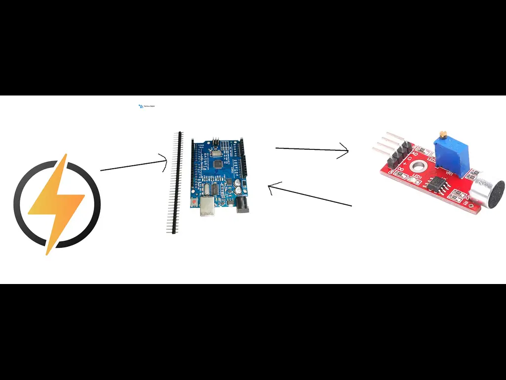
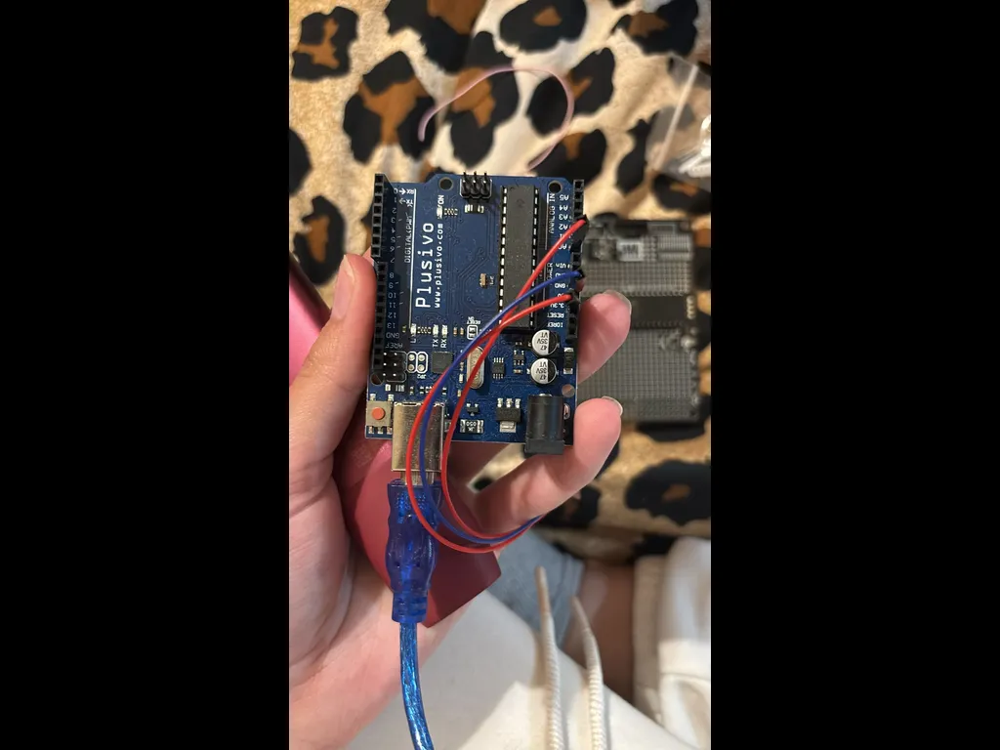
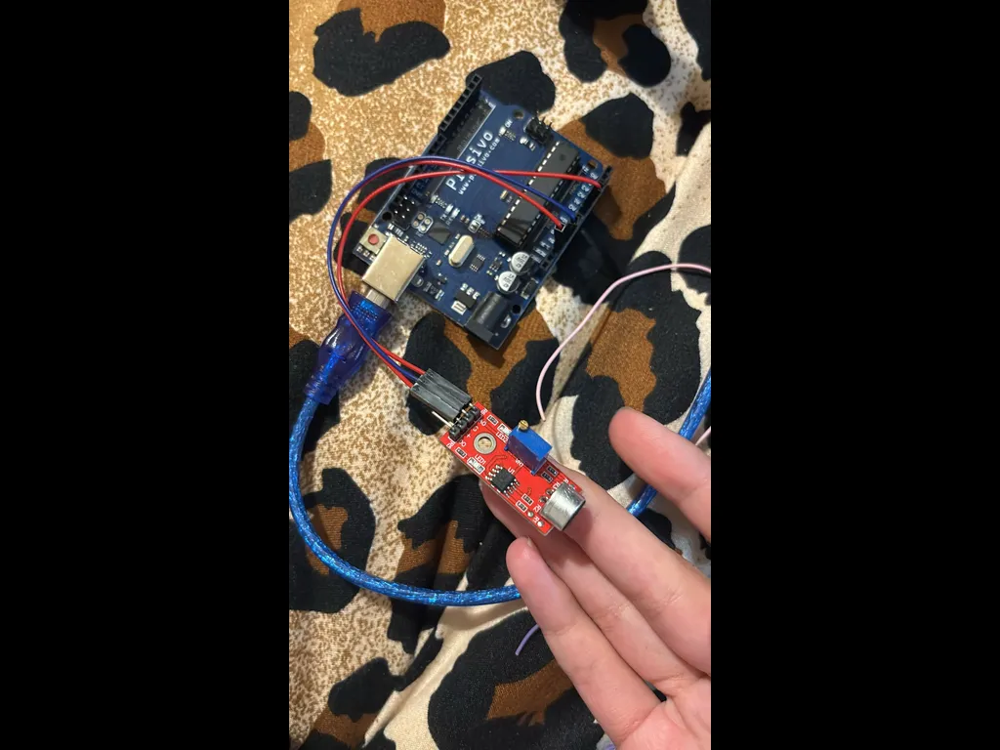

# Audio Logger with Plusivo and AEnalta-4 Microphone

A real-time audio recording system that captures sound using an AEnalta-4 microphone and logs it via a microcontroller.

:::info

**Author**: Yaris Rosioru \
**GitHub Project Link**: [Project Link](https://github.com/UPB-PMRust-Students/project-yaris4261)

:::

## Description

The program is a menu-based interface for basic audio processing. It allows a user to:

1. Record audio from a microphone.

2. Play back the last recorded audio.

3. Play back an audio file from disk.

4. Plot the waveform of recorded or saved audio.

5. Quit the program.

## Motivation

I have worked with controllers, but never with audio card so I figured it was a great opportunity

## Architecture

The diagram above shows the overall system architecture of the project.

## Architecture Details

### Plusivo

**Role**: Handling audio sampling.
**Connections**:

- Analog Pin: Reads microphone output
- Power: Supplied via USB

### AEnalta-4 Microphone

**Role**: Captures raw audio signals.
**Connections**:
- VCC: 5V
- GND: Ground
- OUT: Connected to an analog pin on the Plusivo
- AGND: Analog Ground
  
### Power Supply
**Interface**: USB or battery + regulator  
**Role**: Provides power to the whole system.  
**Connections**:

- USB via USB

## Log

### Week 5 - 11 May

Week was spent acquisitioning and solding the pieces on the board.

### Week 12 - 18 May

Week was spent developing the code for the project.

### Week 19 - 25 May

## Hardware

The system is build around the microcontroller and the microphone

_Fig.1 - Board_

_Fig.2 - Board_

### Schematics

### Bill of Materials

| Device                                                                                                                                                                                                                                                                                                                         | Usage                                | Price     |
| ------------------------------------------------------------------------------------------------------------------------------------------------------------------------------------------------------------------------------------------------------------------------------------------------------------------------------ | ------------------------------------ | --------- |
| Plusivo Board                                                                                                                                                                                                                                                                                                                    | The microcontroller                  | 35 RON    |
| [AEnalta-4 Microphone Module ](https://www.ardumarket.ro/ro/product/modul-senzor-microfon-audio-sensibilitate-%C3%AEnalta-4-pini) | Captures values                         | ~13 RON   |
| [LEDs x1](https://www.optimusdigital.ro/en/leds/931-5-mm-green-led-with-clear-lens.html?search_query=green+LED+&results=237)                                                                                                                                                                                                   | Indicate that the process is working | ~3 RON    |
| [Resistors & Board Wires](https://www.optimusdigital.ro/en/wires-with-connectors/12-breadboard-jumper-wire-set.html?search_query=Breadboard+Wires&results=142)                                                                                                                                                                 | For basic circuit setup              | ~15 RON   |

## Software

| Library                                                    | Description                                             | Usage                                           |
| ---------------------------------------------------------- | ------------------------------------------------------- | ----------------------------------------------- |
| [Rust Embedded HAL](https://crates.io/crates/embedded-hal) | A Hardware Abstraction Layer (HAL) for embedded systems | Used for interating with the controller         |
| [ruduino](https://crates.io/crates/ruduino)                | Reusable components for AVR microcontrollers            | Used for serial ports, times and core functions |

## Links
